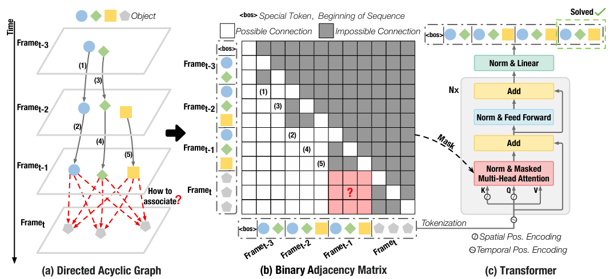
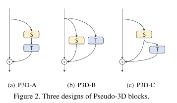
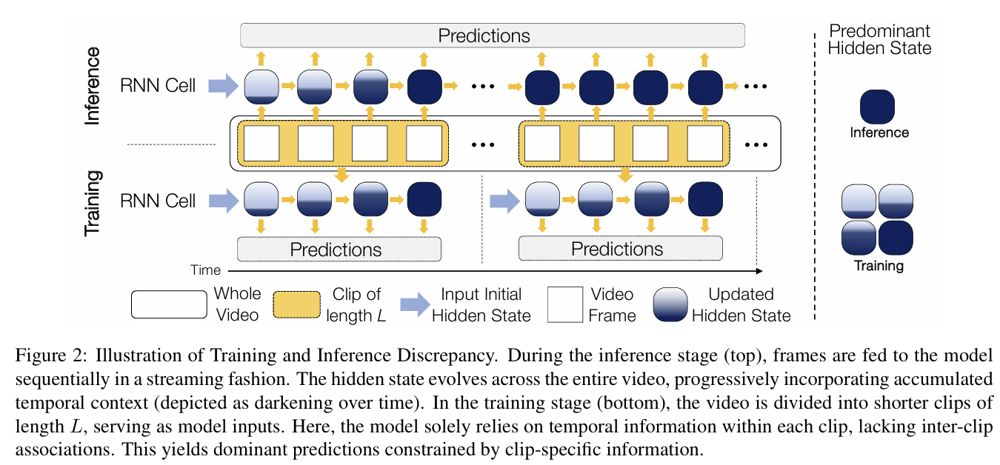
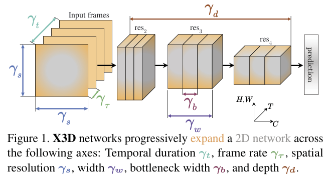
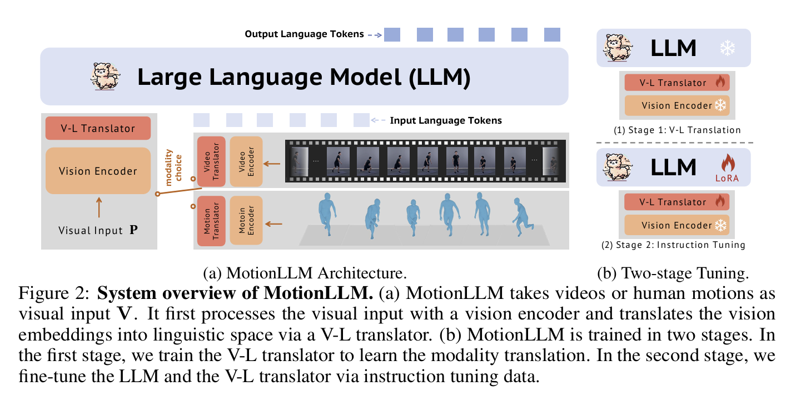
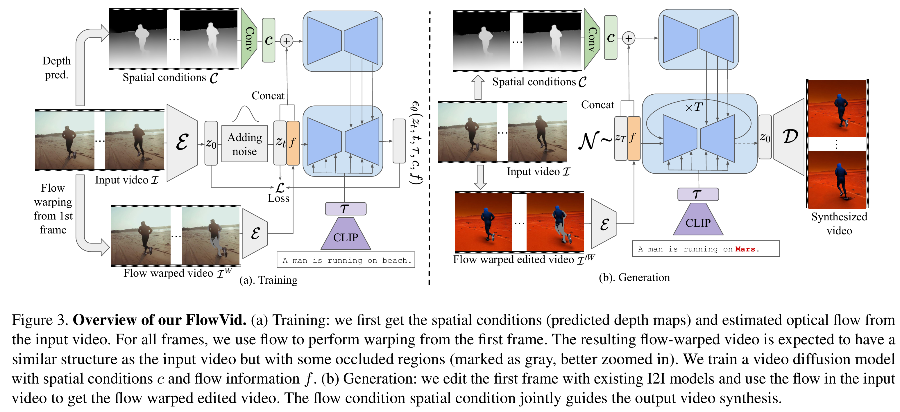
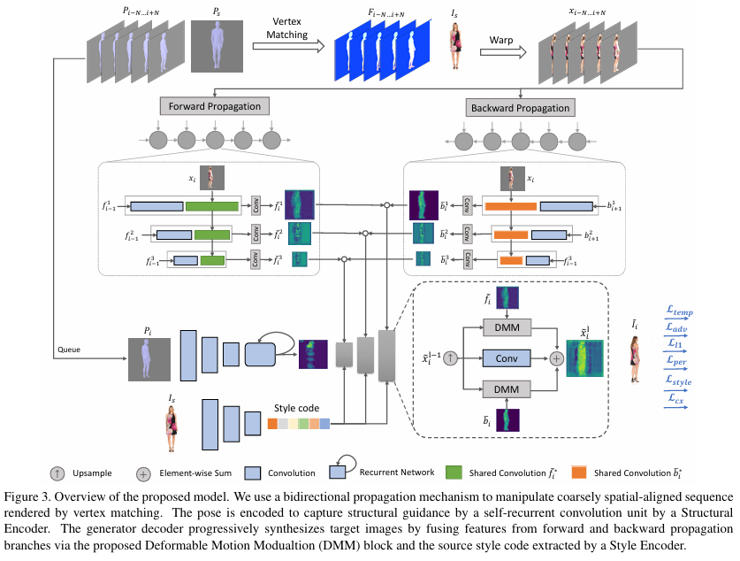

# Deciphering Motion in Visual Dynamics: A Comprehensive Survey

## Full list

### Quick Links

- [Motion Estimation](#Motion-Estimation)
  - [Estimation by Prediction](#estimation-by-prediction)
    - [Physics-Based Methods](#physics--based-methods)
    - [Sequential Modeling Networks](#sequential-modeling-networks)
    - [Generative Models](#generative-models)
  - [Estimation by Correlation](#estimation-by-correlation)
    - [Explicit Computation](#explicit-computation)
    - [Two-Stream Architecture](#two--stream-architecture)
    - [Attention Mechanism](#attention-mechanism)
    - [Implicit Learning](#implicit-learning)
  - [Practical Strategies](#practical-strategies)
    - [Iterative Refinement](#iterative-refinement)
    - [Memory Augmentation](#memory-augmentation)
    - [Online Update](#online-update)
- [Motion Understanding](#motion-understanding)
  - [Motion-Separated Modeling](#motion--separated-modeling)
    - [Intra-Block Separated Modeling](#intra-block-separated-modeling)
    - [Parallel Inter-Block Separated Modeling](#parallel-inter-block-separated-modeling)
    - [Sequential Inter-Block Separated Modeling](#sequential-inter-block-separated-modeling)
  - [Motion-Joint Modeling](#motion-joint-modeling)
    - [Local Operator](#local-operator)
    - [Global Interaction](#global-interaction)
    - [Local-Global Mechanism](#local-global-mechanism)
    - [LLM-based Modeling](#llm-based-modeling)
  - [Context-Augmented Modeling](#context-augmented-modeling)
    - [Multimodal Fusion](#multimodal-fusion)
    - [Cross-Modal Alignment](#cross-modal-alignment)
    - [Contextual Priors](#contextual-priors)
- [Motion Generation](#motion-generation)
  - [Explicit Motion Guidance](#explicit-motion-guidance)
    - [Input-level Embedding](#input-level-embedding)
    - [Latent-level Fusion](#latent-level-fusion)
    - [Architecture-Level Integration](#architecture-level-integration)
  - [Implicit Motion Learning](#implicit-motion-learning)
    - [Input-level Preparation](#input-level-preparation)
    - [Architectural-level Refinement](#architectural-level-refinement)
    - [Training Optimization](#training-optimization)
  - [Practical Strategies](#practical-strategies)
    - [Dynamic Condition](#dynamic-condition)
    - [Frequency Decomposition](#frequency-decomposition)
    - [Extract Motion Representation](#extract-motion-representation)
    - [Autoregressive Generation](#autoregressive-generation)

### Motion Estimation

#### Estimation by Prediction

##### Physics-Based Methods

| Title & Authors                                              | Introduction                   | Links                                                        |
| ------------------------------------------------------------ | ------------------------------ | ------------------------------------------------------------ |
| [An Introduction to the Kalman Filter](https://d1wqtxts1xzle7.cloudfront.net/52484748/Kalman_CoursePack_08-libre.pdf?1491379511=&response-content-disposition=inline%3B+filename%3DAn_Introduction_to_the_Kalman_Filter.pdf&Expires=1750353534&Signature=eCqfwl8yOdlKkJ249wukP8OUaorUeNjMB-SKiEAeqbIMT6EnQRQbx6UZ6jKUCQ5SdCV1CFghv6fNWXHGvduytueZ71b8EPx87Iwdi6CjCh8PZJPCSM47eDjYkJcR81FVMqQaDl9fjs50y1LlEN2HT6DwH4pc2ykGe3VdRdBNO7Cxs9mujCMeLu76RrWn53by5MYMI269-mG~k5br6rdhNxI23xFmVt16SceuaOkF3JN8TW3RXpwm7jESpLYovlDq3qTGejKEZ3zVlV5kOXw~wc8ZC9S7xy2bZJ9uF2WAWY0cQVMBal1XIPTqRdO8vpgPEtWOCg011L6mP4IZtC5dEA__&Key-Pair-Id=APKAJLOHF5GGSLRBV4ZA)   Greg Welch1 and Gary Bishop2 |  | [Paper](https://d1wqtxts1xzle7.cloudfront.net/52484748/Kalman_CoursePack_08-libre.pdf?1491379511=&response-content-disposition=inline%3B+filename%3DAn_Introduction_to_the_Kalman_Filter.pdf&Expires=1750353534&Signature=eCqfwl8yOdlKkJ249wukP8OUaorUeNjMB-SKiEAeqbIMT6EnQRQbx6UZ6jKUCQ5SdCV1CFghv6fNWXHGvduytueZ71b8EPx87Iwdi6CjCh8PZJPCSM47eDjYkJcR81FVMqQaDl9fjs50y1LlEN2HT6DwH4pc2ykGe3VdRdBNO7Cxs9mujCMeLu76RrWn53by5MYMI269-mG~k5br6rdhNxI23xFmVt16SceuaOkF3JN8TW3RXpwm7jESpLYovlDq3qTGejKEZ3zVlV5kOXw~wc8ZC9S7xy2bZJ9uF2WAWY0cQVMBal1XIPTqRdO8vpgPEtWOCg011L6mP4IZtC5dEA__&Key-Pair-Id=APKAJLOHF5GGSLRBV4ZA) |
| [Simple Online and Realtime Tracking](https://arxiv.org/abs/1602.00763)   Alex Bewley, Zongyuan Ge, Lionel Ott, Fabio Ramos, Ben Upcroft |  | [Paper](https://arxiv.org/abs/1602.00763)                    |
| [Simple Online and Realtime Tracking with a Deep Association Metric](https://arxiv.org/abs/1703.07402)   Nicolai Wojke, Alex Bewley, Dietrich Paulus |  | [Paper](https://arxiv.org/abs/1703.07402)                    |
| [ByteTrack: Multi-Object Tracking by Associating Every Detection Box](https://arxiv.org/abs/2110.06864)   Yifu Zhang, Peize Sun, Yi Jiang, Dongdong Yu, Fucheng Weng, Zehuan Yuan, Ping Luo, Wenyu Liu, Xinggang Wang |  | [Project](https://github.com/FoundationVision/ByteTrack)   [Paper](https://arxiv.org/abs/2110.06864) |
| [StrongSORT: Make DeepSORT Great Again](https://arxiv.org/abs/2202.13514)   Yunhao Du, Zhicheng Zhao, Yang Song, Yanyun Zhao, Fei Su, Tao Gong, Hongying Meng |  | [Project](https://github.com/dyhBUPT/StrongSORT) [Project](https://github.com/open-mmlab/mmtracking)   [Paper](https://arxiv.org/abs/2202.13514) |
| [BoT-SORT: Robust Associations Multi-Pedestrian Tracking](https://arxiv.org/abs/2206.14651)   Nir Aharon, Roy Orfaig, Ben-Zion Bobrovsky |  | [Project](https://github.com/NirAharon/BOT-SORT)   [Paper](https://arxiv.org/abs/2206.14651) |
| [FeatureSORT: Essential Features for Effective Tracking](https://arxiv.org/abs/2407.04249)   Hamidreza Hashempoor, Rosemary Koikara, Yu Dong Hwang |  | [Paper](https://arxiv.org/abs/2407.04249)                    |
| [Hybrid-SORT: Weak Cues Matter for Online Multi-Object Tracking](https://arxiv.org/abs/2308.00783)   Mingzhan Yang, Guangxin Han, Bin Yan, Wenhua Zhang, Jinqing Qi, Huchuan Lu, Dong Wang |  | [Project](https://github.com/ymzis69/HybridSORT)   [Paper](https://arxiv.org/abs/2308.00783) |
| [Faster R-CNN: Towards Real-Time Object Detection with Region Proposal Networks](https://arxiv.org/abs/1506.01497)   Shaoqing Ren, Kaiming He, Ross Girshick, Jian Sun |  | [Paper](https://arxiv.org/abs/1506.01497)                    |
| [YOLOX: Exceeding YOLO Series in 2021](https://arxiv.org/abs/2107.08430)   Zheng Ge, Songtao Liu, Feng Wang, Zeming Li, Jian Sun |  | [Project](https://github.com/Megvii-BaseDetection/YOLOX)   [Paper](https://arxiv.org/abs/2107.08430) |
| [The Hungarian method for the assignment problem](https://onlinelibrary.wiley.com/doi/abs/10.1002/nav.3800020109)   H. W. Kuhn |  | [Paper](https://www.math.toronto.edu/mccann/1855/KuhnNRL55.pdf) |
| [KalmanFlow 2.0: Efficient Video Optical Flow Estimation via Context-Aware Kalman Filtering](https://ieeexplore.ieee.org/document/8662710)   Wenbo Bao; Xiaoyun Zhang; Li Chen; Zhiyong Gao |  | [Paper](https://ieeexplore.ieee.org/document/8662710)        |
| [Particle Filters for Multiple Target Tracking](https://www.sciencedirect.com/science/article/pii/S2212017316303061)   Rooji Jinan, Tara Raveendran |  | [Paper](https://www.sciencedirect.com/science/article/pii/S2212017316303061) |
| [Tracking in Low Frame Rate Video: A Cascade Particle Filter with Discriminative Observers of Different Lifespans](http://vigir.missouri.edu/~gdesouza/Research/Conference_CDs/IEEE_CVPR_2007/data/papers/0231.pdf#:~:text=In%20this%20paper%2C%20we%20address%20the%20problem%20from,probabilistic%20combination%20of%20dis-criminative%20observers%20of%20different%20lifespans.)   Yuan Li; Haizhou Ai; Takayoshi Yamashita; Shihong Lao; Masato Kawade |  | [Paper](http://vigir.missouri.edu/~gdesouza/Research/Conference_CDs/IEEE_CVPR_2007/data/papers/0231.pdf#:~:text=In%20this%20paper%2C%20we%20address%20the%20problem%20from,probabilistic%20combination%20of%20dis-criminative%20observers%20of%20different%20lifespans.) |
| [Sequential Monte Carlo tracking by fusing multiple cues in video sequences Author links open overlay panel](https://www.sciencedirect.com/science/article/abs/pii/S0262885606002277)   Paul Brasnett, Lyudmila Mihaylova, David Bull, Nishan Canagarajah |  | [Paper](https://www.sciencedirect.com/science/article/abs/pii/S0262885606002277) |
| [Occluded object tracking using object-background prototypes and particle filter](https://dl.acm.org/doi/10.1007/s10489-020-02047-x)   Ajoy Mondal |  | [Paper](https://dl.acm.org/doi/10.1007/s10489-020-02047-x)   |
| [Color-Based Probabilistic Tracking](https://dl.acm.org/doi/10.5555/645315.649166)   Patrick Pérez, Carine Hue, Jaco Vermaak, Michel Gangnet |  | [Paper](https://dl.acm.org/doi/10.5555/645315.649166)        |
| [Object tracking algorithm based on particle filter with color and texture feature](https://ieeexplore.ieee.org/abstract/document/7553983)   Dongsheng Ding; Zengru Jiang; Chengyuan Liu |  | [Paper](https://ieeexplore.ieee.org/abstract/document/7553983) |
| [Robust visual tracking based on variational auto-encoding Markov chain Monte Carlo](https://www.sciencedirect.com/science/article/abs/pii/S0020025519308618)   Junseok Kwon |  | [Paper](https://www.sciencedirect.com/science/article/abs/pii/S0020025519308618) |

##### Sequential Modeling Networks

| Title & Authors                                              | Introduction                   | Links                                                        |
| ------------------------------------------------------------ | ------------------------------ | ------------------------------------------------------------ |
| [Recurrent Filter Learning for Visual Tracking](https://ieeexplore.ieee.org/document/8265445)   Tianyu Yang; Antoni B. Chan |  | [Paper](https://ieeexplore.ieee.org/document/8265445)        |
| [Cooperative Use of Recurrent Neural Network and Siamese Region Proposal Network for Robust Visual Tracking](https://ieeexplore.ieee.org/document/9400810)   Xuechen Zhao; Yaoming Liu; Guang Han |  | [Paper](https://ieeexplore.ieee.org/document/9400810)        |
| [Attention-Driven Memory Network for Online Visual Tracking](https://ieeexplore.ieee.org/document/10215054)   Huanlong Zhang; Jiamei Liang; Jiapeng Zhang; Tianzhu Zhang; Yingzi Lin; Yanfeng Wang |  | [Paper](https://ieeexplore.ieee.org/document/10215054)       |
| [Learning Dynamic Memory Networks for Object Tracking](https://arxiv.org/abs/1803.07268)   Tianyu Yang, Antoni B. Chan |  | [Paper](https://arxiv.org/abs/1803.07268)                    |
| [Visual Tracking via Dynamic Memory Networks](https://arxiv.org/abs/1907.07613)   Tianyu Yang, Antoni B. Chan |  | [Paper](https://arxiv.org/abs/1907.07613)                    |
| [Object Tracking Using Spatio-Temporal Future Prediction](https://arxiv.org/abs/2010.07605)   Yuan Liu, Ruoteng Li, Robby T. Tan, Yu Cheng, Xiubao Sui |  | [Paper](https://arxiv.org/abs/2010.07605)                    |
| [RAFT: Recurrent All-Pairs Field Transforms for Optical Flow](https://arxiv.org/abs/2003.12039)   Zachary Teed, Jia Deng |  | [Project](https://github.com/princeton-vl/RAFT)   [Paper](https://arxiv.org/abs/2003.12039) |
| [An Image is Worth 16x16 Words: Transformers for Image Recognition at Scale](https://arxiv.org/abs/2010.11929)   Alexey Dosovitskiy, Lucas Beyer, Alexander Kolesnikov, Dirk Weissenborn, Xiaohua Zhai, Thomas Unterthiner, Mostafa Dehghani, Matthias Minderer, Georg Heigold, Sylvain Gelly, Jakob Uszkoreit, Neil Houlsby |  | [Paper](https://arxiv.org/abs/2010.11929)                    |
| [SeqTrack: Sequence to Sequence Learning for Visual Object Tracking](https://ieeexplore.ieee.org/document/10203645)   Xin Chen; Houwen Peng; Dong Wang; Huchuan Lu; Han Hu |  | [Project](https://github.com/microsoft/VideoX)   [Paper](https://ieeexplore.ieee.org/document/10203645) |
| [Is a Pure Transformer Effective for Separated and Online Multi-Object Tracking?](https://arxiv.org/abs/2405.14119)   Chongwei Liu, Haojie Li, Zhihui Wang, Rui Xu |  | [Project](https://github.com/chongweiliu/PuTR)   [Paper](https://arxiv.org/abs/2405.14119) |
| [FlowFormer: A Transformer Architecture for Optical Flow](https://arxiv.org/abs/2203.16194)   Zhaoyang Huang, Xiaoyu Shi, Chao Zhang, Qiang Wang, Ka Chun Cheung, Hongwei Qin, Jifeng Dai, Hongsheng Li |  | [Paper](https://arxiv.org/abs/2203.16194)                    |
| [TransFlow: Transformer as Flow Learner](https://arxiv.org/abs/2304.11523)   Yawen Lu, Qifan Wang, Siqi Ma, Tong Geng, Yingjie Victor Chen, Huaijin Chen, Dongfang Liu |  | [Paper](https://arxiv.org/abs/2304.11523)                    |
| [Mamba: Linear-Time Sequence Modeling with Selective State Spaces](https://arxiv.org/abs/2312.00752)   Albert Gu, Tri Dao |  | [Paper](https://arxiv.org/abs/2312.00752)                    |
| [TrackSSM: A General Motion Predictor by State-Space Model](https://arxiv.org/abs/2409.00487)   Bin Hu, Run Luo, Zelin Liu, Cheng Wang, Wenyu Liu |  | [Project](https://github.com/Xavier-Lin/TrackSSM)   [Paper](https://arxiv.org/abs/2409.00487) |
| [DSTrack: Diffusion-based sequence learning for visual object tracking](https://www.sciencedirect.com/science/article/abs/pii/S0031320325003541#:~:text=In%20this%20paper%2C%20we%20propose%20a%20novel%20approach,from%20limited%20discrete%20variables%20to%20unlimited%20continuous%20probabilities.)   Zhixing Wang, Kai Wang, Chuanming Tang, Xiang Li, Jianlin Zhang, Lianli Gao |  | [Paper](https://www.sciencedirect.com/science/article/abs/pii/S0031320325003541#:~:text=In%20this%20paper%2C%20we%20propose%20a%20novel%20approach,from%20limited%20discrete%20variables%20to%20unlimited%20continuous%20probabilities.) |

##### Generative Models

| Title & Authors                                              | Introduction                   | Links                                                        |
| ------------------------------------------------------------ | ------------------------------ | ------------------------------------------------------------ |
| [Auto-Encoding Variational Bayes](https://arxiv.org/abs/1312.6114)   Diederik P Kingma, Max Welling |  | [Paper](https://arxiv.org/abs/1312.6114)                     |
| [SINT++: Robust Visual Tracking via Adversarial Positive Instance Generation](https://ieeexplore.ieee.org/document/8578609)   Xiao Wang; Chenglong Li; Bin Luo; Jin Tang |  | [Paper](https://ieeexplore.ieee.org/document/8578609)        |
| [Robust visual tracking based on variational auto-encoding Markov chain Monte Carlo](https://www.sciencedirect.com/science/article/abs/pii/S0020025519308618)   Junseok Kwon |  | [Paper](https://www.sciencedirect.com/science/article/abs/pii/S0020025519308618) |
| [Generative Adversarial Networks](https://arxiv.org/abs/1406.2661)   Ian J. Goodfellow, Jean Pouget-Abadie, Mehdi Mirza, Bing Xu, David Warde-Farley, Sherjil Ozair, Aaron Courville, Yoshua Bengio |  | [Paper](https://arxiv.org/abs/1406.2661)                     |
| [Generating Reliable Online Adaptive Templates for Visual Tracking](https://ieeexplore.ieee.org/document/8451440)   Jie Guo; Tingfa Xu; Shenwang Jiang; Ziyi Shen |  | [Paper](https://ieeexplore.ieee.org/document/8451440)        |
| [VITAL: VIsual Tracking via Adversarial Learning](https://arxiv.org/abs/1804.04273)   Yibing Song, Chao Ma, Xiaohe Wu, Lijun Gong, Linchao Bao, Wangmeng Zuo, Chunhua Shen, Rynson Lau, Ming-Hsuan Yang |  | [Paper](https://arxiv.org/abs/1804.04273)                    |
| [Adversarial Feature Sampling Learning for Efficient Visual Tracking](https://arxiv.org/abs/1809.04741)   Yingjie Yin, Lei Zhang, De Xu, Xingang Wang |  | [Paper](https://arxiv.org/abs/1809.04741)                    |
| [GARAT: Generative Adversarial Learning for Robust and Accurate Tracking](https://webvpn.whut.edu.cn/https/77726476706e69737468656265737421e7e056d234336155700b8ca891472636a6d29e640e/science/article/pii/S0893608022000107)   Bowen Yao, Jing Li, Shan Xue,Jia Wu, Huanmei Guan, Jun Chang, Zhiquan Ding |  | [Paper](https://webvpn.whut.edu.cn/https/77726476706e69737468656265737421e7e056d234336155700b8ca891472636a6d29e640e/science/article/pii/S0893608022000107) |
| [Semi-supervised learning for optical flow with Generative Adversarial Networks](https://dl.acm.org/doi/10.5555/3294771.3294805)   Wei-Sheng Lai, Jia-Bin Huang, Ming-Hsuan Yang |  | [Paper](https://dl.acm.org/doi/10.5555/3294771.3294805)      |
| [Denoising Diffusion Probabilistic Models](https://arxiv.org/abs/2006.11239)   Jonathan Ho, Ajay Jain, Pieter Abbeel |  | [Project](https://github.com/hojonathanho/diffusion)   [Paper](https://arxiv.org/abs/2006.11239) |
| [Siamese Network for Object Tracking with Diffusion Model](https://dl.acm.org/doi/abs/10.1145/3604078.3604132)   Jiacheng Zhang, Yifeng Zhang |  | [Paper](https://dl.acm.org/doi/abs/10.1145/3604078.3604132)  |
| [DiffMOT: A Real-time Diffusion-based Multiple Object Tracker with Non-linear Prediction](https://arxiv.org/abs/2403.02075)   Weiyi Lv, Yuhang Huang, Ning Zhang, Ruei-Sung Lin, Mei Han, Dan Zeng |  | [Paper](https://arxiv.org/abs/2403.02075)                    |
| [DSTrack: Diffusion-based sequence learning for visual object tracking](https://www.sciencedirect.com/science/article/abs/pii/S0031320325003541#:~:text=In%20this%20paper%2C%20we%20propose%20a%20novel%20approach,from%20limited%20discrete%20variables%20to%20unlimited%20continuous%20probabilities.)   Zhixing Wang, Kai Wang, Chuanming Tang, Xiang Li, Jianlin Zhang, Lianli Gao |  | [Paper](https://www.sciencedirect.com/science/article/abs/pii/S0031320325003541#:~:text=In%20this%20paper%2C%20we%20propose%20a%20novel%20approach,from%20limited%20discrete%20variables%20to%20unlimited%20continuous%20probabilities.) |
| [DiffusionTrack: Diffusion Model For Multi-Object Tracking](https://arxiv.org/abs/2308.09905)   Run Luo, Zikai Song, Lintao Ma, Jinlin Wei, Wei Yang, Min Yang |  | [Project](https://github.com/RainBowLuoCS/DiffusionTrack)   [Paper](https://arxiv.org/abs/2308.09905) |
| [DiffMOD: Progressive Diffusion Point Denoising for Moving Object Detection in Remote Sensing](https://arxiv.org/abs/2504.10278)   Jinyue Zhang, Xiangrong Zhang, Zhongjian Huang, Tianyang Zhang, Yifei Jiang, Licheng Jiao |  | [Paper](https://arxiv.org/abs/2504.10278)                    |
| [The Surprising Effectiveness of Diffusion Models for Optical Flow and Monocular Depth Estimation](https://arxiv.org/abs/2306.01923)   Saurabh Saxena, Charles Herrmann, Junhwa Hur, Abhishek Kar, Mohammad Norouzi, Deqing Sun, David J. Fleet |  | [Paper](https://arxiv.org/abs/2306.01923)                    |

#### Estimation by Correlation

##### Explicit Computation

| Title & Authors                                              | Introduction                   | Links                                                        |
| ------------------------------------------------------------ | ------------------------------ | ------------------------------------------------------------ |
| [Visual object tracking using adaptive correlation filters](https://webvpn.whut.edu.cn/https/77726476706e69737468656265737421f9f244993f20645f6c0dc7a59d50267b1ab4a9/document/5539960)   David S. Bolme; J. Ross Beveridge; Bruce A. Draper; Yui Man Lui |  | [Paper](https://webvpn.whut.edu.cn/https/77726476706e69737468656265737421f9f244993f20645f6c0dc7a59d50267b1ab4a9/document/5539960) |
| [High-Speed Tracking with Kernelized Correlation Filters](https://arxiv.org/abs/1404.7584)   João F. Henriques, Rui Caseiro, Pedro Martins, Jorge Batista |  | [Paper](https://arxiv.org/abs/1404.7584)                     |
| [Exploiting the Circulant Structure of Tracking-by-Detection with Kernels](https://link.springer.com/chapter/10.1007/978-3-642-33765-9_50)   João F. Henriques, Rui Caseiro, Pedro Martins & Jorge Batista |  | [Paper](https://link.springer.com/chapter/10.1007/978-3-642-33765-9_50) |
| [Adaptive Color Attributes for Real-Time Visual Tracking](https://webvpn.whut.edu.cn/https/77726476706e69737468656265737421f9f244993f20645f6c0dc7a59d50267b1ab4a9/document/6909539)   Martin Danelljan; Fahad Shahbaz Khan; Michael Felsberg; Joost Van De Weijer |  | [Paper](https://webvpn.whut.edu.cn/https/77726476706e69737468656265737421f9f244993f20645f6c0dc7a59d50267b1ab4a9/document/6909539) |
| [Staple: Complementary Learners for Real-Time Tracking](https://arxiv.org/abs/1512.01355)   Luca Bertinetto, Jack Valmadre, Stuart Golodetz, Ondrej Miksik, Philip Torr |  | [Paper](https://arxiv.org/abs/1512.01355)                    |
| [Learning Spatially Regularized Correlation Filters for Visual Tracking](https://arxiv.org/abs/1608.05571)   Martin Danelljan, Gustav Häger, Fahad Shahbaz Khan, Michael Felsberg |  | [Paper](https://arxiv.org/abs/1608.05571)                    |
| [Discriminative Correlation Filter with Channel and Spatial Reliability](https://arxiv.org/abs/1611.08461)   Alan Lukežič, Tomáš Vojíř, Luka Čehovin, Jiří Matas, Matej Kristan |  | [Paper](https://arxiv.org/abs/1611.08461)                    |
| [Learning Background-Aware Correlation Filters for Visual Tracking](https://arxiv.org/abs/1703.04590)   Hamed Kiani Galoogahi, Ashton Fagg, Simon Lucey |  | [Paper](https://arxiv.org/abs/1703.04590)                    |
| [Correlation filters with limited boundaries](https://webvpn.whut.edu.cn/https/77726476706e69737468656265737421f9f244993f20645f6c0dc7a59d50267b1ab4a9/document/7299094)   Hamed Kiani Galoogahi; Terence Sim; Simon Lucey |  | [Paper](https://webvpn.whut.edu.cn/https/77726476706e69737468656265737421f9f244993f20645f6c0dc7a59d50267b1ab4a9/document/7299094) |
| [Visual Tracking via Adaptive Spatially-Regularized Correlation Filters](https://webvpn.whut.edu.cn/https/77726476706e69737468656265737421f9f244993f20645f6c0dc7a59d50267b1ab4a9/document/8953651)   Kenan Dai; Dong Wang; Huchuan Lu; Chong Sun; Jianhua Li |  | [Paper](https://webvpn.whut.edu.cn/https/77726476706e69737468656265737421f9f244993f20645f6c0dc7a59d50267b1ab4a9/document/8953651) |
| [Beyond Correlation Filters: Learning Continuous Convolution Operators for Visual Tracking](https://arxiv.org/abs/1608.03773)   Martin Danelljan, Andreas Robinson, Fahad Shahbaz Khan, Michael Felsberg |  | [Paper](https://arxiv.org/abs/1608.03773)                    |
| [ECO: Efficient Convolution Operators for Tracking](https://arxiv.org/abs/1611.09224)   Martin Danelljan, Goutam Bhat, Fahad Shahbaz Khan, Michael Felsberg |  | [Paper](https://arxiv.org/abs/1611.09224)                    |
| [Unveiling the Power of Deep Tracking](https://arxiv.org/abs/1804.06833)   Goutam Bhat, Joakim Johnander, Martin Danelljan, Fahad Shahbaz Khan, Michael Felsberg |  | [Paper](https://arxiv.org/abs/1804.06833)                    |
| [Determining optical flow](https://www.sciencedirect.com/science/article/abs/pii/0004370281900242)   Berthold K.P. Horn, Brian G. Schunck |  | [Paper](https://www.sciencedirect.com/science/article/abs/pii/0004370281900242) |
| [An iterative image registration technique with an application to stereo vision](https://dl.acm.org/doi/10.5555/1623264.1623280)   Bruce D. Lucas, Takeo Kanade |  | [Paper](https://dl.acm.org/doi/10.5555/1623264.1623280)      |

##### Two-Stream Architecture

| Title & Authors                                              | Introduction                   | Links                                                        |
| ------------------------------------------------------------ | ------------------------------ | ------------------------------------------------------------ |
| [Fully-Convolutional Siamese Networks for Object Tracking](https://arxiv.org/abs/1606.09549)   Luca Bertinetto, Jack Valmadre, João F. Henriques, Andrea Vedaldi, Philip H. S. Torr |  | [Paper](https://arxiv.org/abs/1606.09549)                    |
| [Siamese Instance Search for Tracking](https://arxiv.org/abs/1605.05863)   Ran Tao, Efstratios Gavves, Arnold W.M. Smeulders |  | [Paper](https://arxiv.org/abs/1605.05863)                    |
| [High Performance Visual Tracking with Siamese Region Proposal Network](https://ieeexplore.ieee.org/document/8579033)   Bo Li; Junjie Yan; Wei Wu; Zheng Zhu; Xiaolin Hu |  | [Paper](https://ieeexplore.ieee.org/document/8579033)        |
| [Distractor-aware Siamese Networks for Visual Object Tracking](https://arxiv.org/abs/1808.06048)   Zheng Zhu, Qiang Wang, Bo Li, Wei Wu, Junjie Yan, Weiming Hu |  | [Project](https://github.com/foolwood/DaSiamRPN)   [Paper](https://arxiv.org/abs/1808.06048) |
| [SiamRPN++: Evolution of Siamese Visual Tracking with Very Deep Networks](https://arxiv.org/abs/1812.11703)   Bo Li, Wei Wu, Qiang Wang, Fangyi Zhang, Junliang Xing, Junjie Yan |  | [Project](https://lb1100.github.io/SiamRPN++/)   [Paper](https://arxiv.org/abs/1812.11703) |
| [Deeper and Wider Siamese Networks for Real-Time Visual Tracking](https://arxiv.org/abs/1901.01660)   Zhipeng Zhang, Houwen Peng |  | [Paper](https://arxiv.org/abs/1901.01660)                    |
| [Ocean: Object-aware Anchor-free Tracking](https://arxiv.org/abs/2006.10721)   Zhipeng Zhang, Houwen Peng, Jianlong Fu, Bing Li, Weiming Hu |  | [Project](https://github.com/researchmm/TracKit)   [Paper](https://arxiv.org/abs/2006.10721) |
| [SiamCAR: Siamese Fully Convolutional Classification and Regression for Visual Tracking](https://arxiv.org/abs/1911.07241)   Dongyan Guo, Jun Wang, Ying Cui, Zhenhua Wang, Shengyong Chen |  | [Paper](https://arxiv.org/abs/1911.07241)                    |
| [Siamese Box Adaptive Network for Visual Tracking](https://arxiv.org/abs/2003.06761)   Zedu Chen, Bineng Zhong, Guorong Li, Shengping Zhang, Rongrong Ji |  | [Project](https://github.com/hqucv/siamban)   [Paper](https://arxiv.org/abs/2003.06761) |
| [Fast Online Object Tracking and Segmentation: A Unifying Approach](https://arxiv.org/abs/1812.05050)   Qiang Wang, Li Zhang, Luca Bertinetto, Weiming Hu, Philip H.S. Torr |  | [Project](https://www.robots.ox.ac.uk/~qwang/SiamMask/)   [Paper](https://arxiv.org/abs/1812.05050) |
| [Graph Attention Tracking](https://arxiv.org/abs/2011.11204)   Dongyan Guo, Yanyan Shao, Ying Cui, Zhenhua Wang, Liyan Zhang, Chunhua Shen |  | [Project](https://github.com/ohhhyeahhh/SiamGAT)   [Paper](https://arxiv.org/abs/2011.11204) |
| [Siam R-CNN: Visual Tracking by Re-Detection](https://arxiv.org/abs/1911.12836)   Paul Voigtlaender, Jonathon Luiten, Philip H.S. Torr, Bastian Leibe |  | [Project](http://www.vision.rwth-aachen.de/page/siamrcnn)   [Paper](https://arxiv.org/abs/1911.12836) |
| [BoT-SORT: Robust Associations Multi-Pedestrian Tracking](https://arxiv.org/abs/2206.14651)   Nir Aharon, Roy Orfaig, Ben-Zion Bobrovsky |  | [Project](https://github.com/NirAharon/BOT-SORT)   [Paper](https://arxiv.org/abs/2206.14651) |
| [When to Extract ReID Features: A Selective Approach for Improved Multiple Object Tracking](https://arxiv.org/abs/2409.06617)   Emirhan Bayar, Cemal Aker |  | [Project](https://github.com/emirhanbayar/Fast-StrongSORT)   [Project](https://github.com/emirhanbayar/Fast-Deep-OC-SORT)   [Paper](https://arxiv.org/abs/2409.06617) |
| [History-Aware Transformation of ReID Features for Multiple Object Tracking](https://arxiv.org/abs/2503.12562)   Ruopeng Gao, Yuyao Wang, Chunxu Liu, Limin Wang |  | [Project](https://github.com/HELLORPG/HATReID-MOT)   [Paper](https://arxiv.org/abs/2503.12562) |
| [FlowNet: Learning Optical Flow with Convolutional Networks](https://arxiv.org/abs/1504.06852)   Philipp Fischer, Alexey Dosovitskiy, Eddy Ilg, Philip Häusser, Caner Hazırbaş, Vladimir Golkov, Patrick van der Smagt, Daniel Cremers, Thomas Brox |  | [Paper](https://arxiv.org/abs/1504.06852)                    |
| [PWC-Net: CNNs for Optical Flow Using Pyramid, Warping, and Cost Volume](https://arxiv.org/abs/1709.02371)   Deqing Sun, Xiaodong Yang, Ming-Yu Liu, Jan Kautz |  | [Project](https://github.com/NVlabs/PWC-Net)   [Paper](https://arxiv.org/abs/1709.02371) |
| [LiteFlowNet: A Lightweight Convolutional Neural Network for Optical Flow Estimation](https://arxiv.org/abs/1805.07036)   Tak-Wai Hui, Xiaoou Tang, Chen Change Loy |  | [Project](https://github.com/twhui/LiteFlowNet)   [Paper](https://arxiv.org/abs/1805.07036) |

##### Attention Mechanism

| Title & Authors                                              | Introduction                    | Links                                                        |
| ------------------------------------------------------------ | ------------------------------- | ------------------------------------------------------------ |
| [Transformer Tracking](https://arxiv.org/abs/2103.15436)   Xin Chen, Bin Yan, Jiawen Zhu, Dong Wang, Xiaoyun Yang, Huchuan Lu |   | [Project](https://github.com/chenxin-dlut/TransT)   [Paper](https://arxiv.org/abs/2103.15436) |
| [Learning Spatio-Temporal Transformer for Visual Tracking](https://arxiv.org/abs/2103.17154)   Bin Yan, Houwen Peng, Jianlong Fu, Dong Wang, Huchuan Lu |   | [Project](https://github.com/researchmm/Stark)   [Paper](https://arxiv.org/abs/2103.17154) |
| [Transformer Meets Tracker: Exploiting Temporal Context for Robust Visual Tracking](https://arxiv.org/abs/2103.11681)   Ning Wang, Wengang Zhou, Jie Wang, Houqaing Li |   | [Project](https://github.com/594422814/TransformerTrack)   [Paper](https://arxiv.org/abs/2103.11681) |
| [AiATrack: Attention in Attention for Transformer Visual Tracking](https://arxiv.org/abs/2207.09603)   Shenyuan Gao, Chunluan Zhou, Chao Ma, Xinggang Wang, Junsong Yuan |  | [Project](https://github.com/Little-Podi/AiATrack)   [Paper](https://arxiv.org/abs/2207.09603) |
| [Transformer Tracking with Cyclic Shifting Window Attention](https://arxiv.org/abs/2205.03806)   Zikai Song, Junqing Yu, Yi-Ping Phoebe Chen, Wei Yang |  | [Project](https://github.com/SkyeSong38/CSWinTT)   [Paper](https://arxiv.org/abs/2205.03806) |
| [MixFormer: End-to-End Tracking with Iterative Mixed Attention](https://arxiv.org/abs/2203.11082)   Yutao Cui, Cheng Jiang, Limin Wang, Gangshan Wu |  | [Project](https://github.com/MCG-NJU/MixFormer)   [Paper](https://arxiv.org/abs/2203.11082) |
| [Joint Feature Learning and Relation Modeling for Tracking: A One-Stream Framework](https://arxiv.org/abs/2203.11991)   Botao Ye, Hong Chang, Bingpeng Ma, Shiguang Shan, Xilin Chen |  | [Project](https://github.com/botaoye/OSTrack)   [Paper](https://arxiv.org/abs/2203.11991) |
| [Backbone is All Your Need: A Simplified Architecture for Visual Object Tracking](https://arxiv.org/abs/2203.05328)   Boyu Chen, Peixia Li, Lei Bai, Lei Qiao, Qiuhong Shen, Bo Li, Weihao Gan, Wei Wu, Wanli Ouyang |  | [Project](https://github.com/LPXTT/SimTrack)   [Paper](https://arxiv.org/abs/2203.05328) |
| [ProContEXT: Exploring Progressive Context Transformer for Tracking](https://arxiv.org/abs/2210.15511)   Jin-Peng Lan, Zhi-Qi Cheng, Jun-Yan He, Chenyang Li, Bin Luo, Xu Bao, Wangmeng Xiang, Yifeng Geng, Xuansong Xie |  | [Project](https://github.com/jp-lan/ProContEXT)   [Paper](https://arxiv.org/abs/2210.15511) |
| [VideoTrack: Learning to Track Objects via Video Transformer](https://ieeexplore.ieee.org/document/10204143)   Fei Xie; Lei Chu; Jiahao Li; Yan Lu; Chao Ma |  | [Paper](https://ieeexplore.ieee.org/document/10204143)       |
| [Learning Tracking Representations via Dual-Branch Fully Transformer Networks](https://arxiv.org/abs/2112.02571)   Fei Xie, Chunyu Wang, Guangting Wang, Wankou Yang, Wenjun Zeng |  | [Project](https://github.com/phiphiphi31/DualTFR)   [Paper](https://arxiv.org/abs/2112.02571) |
| [SwinTrack: A Simple and Strong Baseline for Transformer Tracking](https://arxiv.org/abs/2112.00995)   Liting Lin, Heng Fan, Zhipeng Zhang, Yong Xu, Haibin Ling |  | [Project](https://github.com/LitingLin/SwinTrack)   [Paper](https://arxiv.org/abs/2112.00995) |
| [Learning Attentions: Residual Attentional Siamese Network for High Performance Online Visual Tracking](https://ieeexplore.ieee.org/document/8578608)   Qiang Wang; Zhu Teng; Junliang Xing; Jin Gao; Weiming Hu; Stephen Maybank |  | [Project](https://github.com/foolwood/RASNet)   [Paper](https://ieeexplore.ieee.org/document/8578608) |
| [Deformable Siamese Attention Networks for Visual Object Tracking](https://arxiv.org/abs/2004.06711)   Yuechen Yu, Yilei Xiong, Weilin Huang, Matthew R. Scott |  | [Project](https://github.com/msight-tech/research-siamattn)   [Paper](https://arxiv.org/abs/2004.06711) |
| [HiFT: Hierarchical Feature Transformer for Aerial Tracking](https://arxiv.org/abs/2108.00202)   Ziang Cao, Changhong Fu, Junjie Ye, Bowen Li, Yiming Li |  | [Project](https://github.com/vision4robotics/HiFT)   [Paper](https://arxiv.org/abs/2108.00202) |
| [Transforming Model Prediction for Tracking](https://arxiv.org/abs/2203.11192)   Christoph Mayer, Martin Danelljan, Goutam Bhat, Matthieu Paul, Danda Pani Paudel, Fisher Yu, Luc Van Gool |  | [Project](https://github.com/visionml/pytracking)   [Paper](https://arxiv.org/abs/2203.11192) |
| [High-Performance Discriminative Tracking with Transformers](https://ieeexplore.ieee.org/document/9710969)   Bin Yu; Ming Tang; Linyu Zheng; Guibo Zhu; Jinqiao Wang; Hao Feng |  | [Paper](https://ieeexplore.ieee.org/document/9710969)        |
| [SparseTT: Visual Tracking with Sparse Transformers](https://arxiv.org/abs/2205.03776)   Zhihong Fu, Zehua Fu, Qingjie Liu, Wenrui Cai, Yunhong Wang |  | [Project](https://github.com/fzh0917/SparseTT)   [Paper](https://arxiv.org/abs/2205.03776) |
| [Generalized Relation Modeling for Transformer Tracking](https://arxiv.org/abs/2303.16580)   Shenyuan Gao, Chunluan Zhou, Jun Zhang |  | [Project](https://github.com/Little-Podi/GRM)   [Paper](https://arxiv.org/abs/2303.16580) |
| [Is a Pure Transformer Effective for Separated and Online Multi-Object Tracking?](https://arxiv.org/abs/2405.14119)   Chongwei Liu, Haojie Li, Zhihui Wang, Rui Xu |   | [Project](https://github.com/chongweiliu/PuTR)   [Paper](https://arxiv.org/abs/2405.14119) |
| [History-Aware Transformation of ReID Features for Multiple Object Tracking](https://arxiv.org/abs/2503.12562)   Ruopeng Gao, Yuyao Wang, Chunxu Liu, Limin Wang |   | [Project](https://github.com/HELLORPG/HATReID-MOT)   [Paper](https://arxiv.org/abs/2503.12562) |
| [DSTrack: Diffusion-based sequence learning for visual object tracking](https://www.sciencedirect.com/science/article/abs/pii/S0031320325003541#:~:text=In%20this%20paper%2C%20we%20propose%20a%20novel%20approach,from%20limited%20discrete%20variables%20to%20unlimited%20continuous%20probabilities.)   Zhixing Wang, Kai Wang, Chuanming Tang, Xiang Li, Jianlin Zhang, Lianli Gao |   | [Paper](https://www.sciencedirect.com/science/article/abs/pii/S0031320325003541#:~:text=In%20this%20paper%2C%20we%20propose%20a%20novel%20approach,from%20limited%20discrete%20variables%20to%20unlimited%20continuous%20probabilities.) |
| [FlowFormer: A Transformer Architecture for Optical Flow](https://arxiv.org/abs/2203.16194)   Zhaoyang Huang, Xiaoyu Shi, Chao Zhang, Qiang Wang, Ka Chun Cheung, Hongwei Qin, Jifeng Dai, Hongsheng Li |   | [Paper](https://arxiv.org/abs/2203.16194)                    |
| [Global Matching with Overlapping Attention for Optical Flow Estimation](https://arxiv.org/abs/2203.11335)   Shiyu Zhao, Long Zhao, Zhixing Zhang, Enyu Zhou, Dimitris Metaxas |  | [Project](https://github.com/xiaofeng94/GMFlowNet)   [Paper](https://arxiv.org/abs/2203.11335) |
| [VideoFlow: Exploiting Temporal Cues for Multi-frame Optical Flow Estimation](https://arxiv.org/abs/2303.08340)   Xiaoyu Shi, Zhaoyang Huang, Weikang Bian, Dasong Li, Manyuan Zhang, Ka Chun Cheung, Simon See, Hongwei Qin, Jifeng Dai, Hongsheng Li |  | [Project](https://github.com/XiaoyuShi97/VideoFlow)   [Paper](https://arxiv.org/abs/2303.08340) |

##### Implicit Learning

| Title & Authors                                              | Introduction                    | Links                                                        |
| ------------------------------------------------------------ | ------------------------------- | ------------------------------------------------------------ |
| [Learning Multi-Domain Convolutional Neural Networks for Visual Tracking](https://arxiv.org/abs/1510.07945)   Hyeonseob Nam, Bohyung Han |  | [Paper](https://arxiv.org/abs/1510.07945)                    |
| [Real-Time MDNet](https://arxiv.org/abs/1808.08834)   Ilchae Jung, Jeany Son, Mooyeol Baek, Bohyung Han |  | [Paper](https://arxiv.org/abs/1808.08834)                    |
| [Modeling and Propagating CNNs in a Tree Structure for Visual Tracking](https://arxiv.org/abs/1608.07242)   Hyeonseob Nam, Mooyeol Baek, Bohyung Han |  | [Paper](https://arxiv.org/abs/1608.07242)                    |
| [ATOM: Accurate Tracking by Overlap Maximization](https://arxiv.org/abs/1811.07628)   Martin Danelljan, Goutam Bhat, Fahad Shahbaz Khan, Michael Felsberg |  | [Project](https://github.com/visionml/pytracking)   [Paper](https://arxiv.org/abs/1811.07628) |
| [Learning Discriminative Model Prediction for Tracking](https://arxiv.org/abs/1904.07220)   Goutam Bhat, Martin Danelljan, Luc Van Gool, Radu Timofte |  | [Project](https://github.com/visionml/pytracking)   [Paper](https://arxiv.org/abs/1904.07220) |
| [Probabilistic Regression for Visual Tracking](https://arxiv.org/abs/2003.12565)   Martin Danelljan, Luc Van Gool, Radu Timofte |  | [Project](https://github.com/visionml/pytracking)   [Paper](https://arxiv.org/abs/2003.12565) |
| [CREST: Convolutional Residual Learning for Visual Tracking](https://arxiv.org/abs/1708.00225)   Yibing Song, Chao Ma, Lijun Gong, Jiawei Zhang, Rynson Lau, Ming-Hsuan Yang |  | [Paper](https://arxiv.org/abs/1708.00225)                    |
| [Graph Convolutional Tracking](https://ieeexplore.ieee.org/document/8953448)   Junyu Gao; Tianzhu Zhang; Changsheng Xu |  | [Paper](https://ieeexplore.ieee.org/document/8953448)        |
| [Unifying Short and Long-Term Tracking with Graph Hierarchies](https://arxiv.org/abs/2212.03038)   Orcun Cetintas, Guillem Brasó, Laura Leal-Taixé |  | [Project](https://github.com/dvl-tum/SUSHI)   [Paper](https://arxiv.org/abs/2212.03038) |
| [FlowNet 2.0: Evolution of Optical Flow Estimation with Deep Networks](https://arxiv.org/abs/1612.01925)   Eddy Ilg, Nikolaus Mayer, Tonmoy Saikia, Margret Keuper, Alexey Dosovitskiy, Thomas Brox |  | [Paper](https://arxiv.org/abs/1612.01925)                    |
| [Optical Flow Estimation using a Spatial Pyramid Network](https://arxiv.org/abs/1611.00850)   Anurag Ranjan, Michael J. Black |  | [Project](https://github.com/anuragranj/spynet)   [Paper](https://arxiv.org/abs/1611.00850) |

#### Practical Strategies

##### Iterative Refinement

| Title & Authors                                              | Introduction                    | Links                                                        |
| ------------------------------------------------------------ | ------------------------------- | ------------------------------------------------------------ |
| [Siamese Cascaded Region Proposal Networks for Real-Time Visual Tracking](https://arxiv.org/abs/1812.06148)   Heng Fan, Haibin Ling |  | [Paper](https://arxiv.org/abs/1812.06148)                    |
| [ATOM: Accurate Tracking by Overlap Maximization](https://arxiv.org/abs/1811.07628)   Martin Danelljan, Goutam Bhat, Fahad Shahbaz Khan, Michael Felsberg |  | [Project](https://github.com/visionml/pytracking)   [Paper](https://arxiv.org/abs/1811.07628) |
| [Learning Discriminative Model Prediction for Tracking](https://arxiv.org/abs/1904.07220)   Goutam Bhat, Martin Danelljan, Luc Van Gool, Radu Timofte |  | [Project](https://github.com/visionml/pytracking)   [Paper](https://arxiv.org/abs/1904.07220) |
| [Probabilistic Regression for Visual Tracking](https://arxiv.org/abs/2003.12565)   Martin Danelljan, Luc Van Gool, Radu Timofte |  | [Project](https://github.com/visionml/pytracking)   [Paper](https://arxiv.org/abs/2003.12565) |
| [Temporal Coherent Object Flow for Multi-Object Tracking](https://ojs.aaai.org/index.php/AAAI/article/view/32749#:~:text=In%20this%20study%2C%20we%20propose%20a%20section-based%20multi-object,the%20basic%20processing%20unit%2C%20denoted%20as%20a%20%E2%80%9Csection%E2%80%9D.)   Zikai Song, Run Luo, Lintao Ma, Ying Tang, Yi-Ping Phoebe Chen, Junqing Yu, Wei Yang |  | [Paper](https://ojs.aaai.org/index.php/AAAI/article/view/32749#:~:text=In%20this%20study%2C%20we%20propose%20a%20section-based%20multi-object,the%20basic%20processing%20unit%2C%20denoted%20as%20a%20%E2%80%9Csection%E2%80%9D.) |
| [MixFormer: End-to-End Tracking with Iterative Mixed Attention](https://arxiv.org/abs/2203.11082)   Yutao Cui, Cheng Jiang, Limin Wang, Gangshan Wu |  | [Project](https://github.com/MCG-NJU/MixFormer)   [Paper](https://arxiv.org/abs/2203.11082) |
| [PWC-Net: CNNs for Optical Flow Using Pyramid, Warping, and Cost Volume](https://arxiv.org/abs/1709.02371)   Deqing Sun, Xiaodong Yang, Ming-Yu Liu, Jan Kautz |   | [Project](https://github.com/NVlabs/PWC-Net)   [Paper](https://arxiv.org/abs/1709.02371) |
| [LiteFlowNet: A Lightweight Convolutional Neural Network for Optical Flow Estimation](https://arxiv.org/abs/1805.07036)   Tak-Wai Hui, Xiaoou Tang, Chen Change Loy |   | [Project](https://github.com/twhui/LiteFlowNet)   [Paper](https://arxiv.org/abs/1805.07036) |
| [RAFT: Recurrent All-Pairs Field Transforms for Optical Flow](https://arxiv.org/abs/2003.12039)   Zachary Teed, Jia Deng |   | [Project](https://github.com/princeton-vl/RAFT)   [Paper](https://arxiv.org/abs/2003.12039) |

##### Memory Augmentation

| Title & Authors                                              | Introduction                    | Links                                                        |
| ------------------------------------------------------------ | ------------------------------- | ------------------------------------------------------------ |
| [High-Performance Long-Term Tracking with Meta-Updater](https://arxiv.org/abs/2004.00305)   Kenan Dai, Yunhua Zhang, Dong Wang, Jianhua Li, Huchuan Lu, Xiaoyun Yang |  | [Project](https://github.com/Daikenan/LTMU)   [Paper](https://arxiv.org/abs/2004.00305) |
| [Long-Term Visual Object Tracking via Continual Learning](https://ieeexplore.ieee.org/document/8935200)   Hui Zhang; Mu Zhu; Jing Zhang; Li Zhuo |  | [Paper](https://ieeexplore.ieee.org/document/8935200)        |
| [Attention-Driven Memory Network for Online Visual Tracking](https://ieeexplore.ieee.org/document/10215054)   Huanlong Zhang; Jiamei Liang; Jiapeng Zhang; Tianzhu Zhang; Yingzi Lin; Yanfeng Wang |   | [Paper](https://ieeexplore.ieee.org/document/10215054)       |
| [Robust Tracking via Fully Exploring Background Prior Knowledge](https://ieeexplore.ieee.org/abstract/document/10280131)   Zheng’ao Wang; Zikun Zhou; Fanglin Chen; Jun Xu; Wenjie Pei; Guangming Lu |  | [Paper](https://ieeexplore.ieee.org/abstract/document/10280131) |
| [Learning Spatio-Temporal Transformer for Visual Tracking](https://arxiv.org/abs/2103.17154)   Bin Yan, Houwen Peng, Jianlong Fu, Dong Wang, Huchuan Lu |   | [Project](https://github.com/researchmm/Stark)   [Paper](https://arxiv.org/abs/2103.17154) |
| [Transforming Model Prediction for Tracking](https://arxiv.org/abs/2203.11192)   Christoph Mayer, Martin Danelljan, Goutam Bhat, Matthieu Paul, Danda Pani Paudel, Fisher Yu, Luc Van Gool |  | [Project](https://github.com/visionml/pytracking)   [Paper](https://arxiv.org/abs/2203.11192) |
| [VideoTrack: Learning to Track Objects via Video Transformer](https://ieeexplore.ieee.org/document/10204143)   Fei Xie; Lei Chu; Jiahao Li; Yan Lu; Chao Ma |  | [Paper](https://ieeexplore.ieee.org/document/10204143)       |
| [ProContEXT: Exploring Progressive Context Transformer for Tracking](https://arxiv.org/abs/2210.15511)   Jin-Peng Lan, Zhi-Qi Cheng, Jun-Yan He, Chenyang Li, Bin Luo, Xu Bao, Wangmeng Xiang, Yifeng Geng, Xuansong Xie |  | [Project](https://github.com/jp-lan/ProContEXT)   [Paper](https://arxiv.org/abs/2210.15511) |
| [MeMOT: Multi-Object Tracking with Memory](https://arxiv.org/abs/2203.16761)   Jiarui Cai, Mingze Xu, Wei Li, Yuanjun Xiong, Wei Xia, Zhuowen Tu, Stefano Soatto |  | [Paper](https://arxiv.org/abs/2203.16761)                    |
| [MeMOTR: Long-Term Memory-Augmented Transformer for Multi-Object Tracking](https://arxiv.org/abs/2307.15700)   Ruopeng Gao, Limin Wang |  | [Project](https://github.com/MCG-NJU/MeMOTR)   [Paper](https://arxiv.org/abs/2307.15700) |
| [MemFlow: Optical Flow Estimation and Prediction with Memory](https://arxiv.org/abs/2404.04808)   Qiaole Dong, Yanwei Fu |  | [Project](https://dqiaole.github.io/MemFlow/)   [Paper](https://arxiv.org/abs/2404.04808) |
| [Siamese Cascaded Region Proposal Networks for Real-Time Visual Tracking](https://arxiv.org/abs/1812.06148)   Heng Fan, Haibin Ling |  | [Paper](https://arxiv.org/abs/1812.06148)                    |
| [ATOM: Accurate Tracking by Overlap Maximization](https://arxiv.org/abs/1811.07628)   Martin Danelljan, Goutam Bhat, Fahad Shahbaz Khan, Michael Felsberg |  | [Project](https://github.com/visionml/pytracking)   [Paper](https://arxiv.org/abs/1811.07628) |
| [Learning Discriminative Model Prediction for Tracking](https://arxiv.org/abs/1904.07220)   Goutam Bhat, Martin Danelljan, Luc Van Gool, Radu Timofte |  | [Project](https://github.com/visionml/pytracking)   [Paper](https://arxiv.org/abs/1904.07220) |
| [Probabilistic Regression for Visual Tracking](https://arxiv.org/abs/2003.12565)   Martin Danelljan, Luc Van Gool, Radu Timofte |  | [Project](https://github.com/visionml/pytracking)   [Paper](https://arxiv.org/abs/2003.12565) |
| [Temporal Coherent Object Flow for Multi-Object Tracking](https://ojs.aaai.org/index.php/AAAI/article/view/32749#:~:text=In%20this%20study%2C%20we%20propose%20a%20section-based%20multi-object,the%20basic%20processing%20unit%2C%20denoted%20as%20a%20%E2%80%9Csection%E2%80%9D.)   Zikai Song, Run Luo, Lintao Ma, Ying Tang, Yi-Ping Phoebe Chen, Junqing Yu, Wei Yang |  | [Paper](https://ojs.aaai.org/index.php/AAAI/article/view/32749#:~:text=In%20this%20study%2C%20we%20propose%20a%20section-based%20multi-object,the%20basic%20processing%20unit%2C%20denoted%20as%20a%20%E2%80%9Csection%E2%80%9D.) |
| [MixFormer: End-to-End Tracking with Iterative Mixed Attention](https://arxiv.org/abs/2203.11082)   Yutao Cui, Cheng Jiang, Limin Wang, Gangshan Wu |  | [Project](https://github.com/MCG-NJU/MixFormer)   [Paper](https://arxiv.org/abs/2203.11082) |
| [PWC-Net: CNNs for Optical Flow Using Pyramid, Warping, and Cost Volume](https://arxiv.org/abs/1709.02371)   Deqing Sun, Xiaodong Yang, Ming-Yu Liu, Jan Kautz |   | [Project](https://github.com/NVlabs/PWC-Net)   [Paper](https://arxiv.org/abs/1709.02371) |
| [LiteFlowNet: A Lightweight Convolutional Neural Network for Optical Flow Estimation](https://arxiv.org/abs/1805.07036)   Tak-Wai Hui, Xiaoou Tang, Chen Change Loy |   | [Project](https://github.com/twhui/LiteFlowNet)   [Paper](https://arxiv.org/abs/1805.07036) |
| [RAFT: Recurrent All-Pairs Field Transforms for Optical Flow](https://arxiv.org/abs/2003.12039)   Zachary Teed, Jia Deng |   | [Project](https://github.com/princeton-vl/RAFT)   [Paper](https://arxiv.org/abs/2003.12039) |

##### Online Update

| Title & Authors                                              | Introduction                    | Links                                                        |
| ------------------------------------------------------------ | ------------------------------- | ------------------------------------------------------------ |
| [Visual object tracking using adaptive correlation filters](https://webvpn.whut.edu.cn/https/77726476706e69737468656265737421f9f244993f20645f6c0dc7a59d50267b1ab4a9/document/5539960)   David S. Bolme; J. Ross Beveridge; Bruce A. Draper; Yui Man Lui |   | [Paper](https://webvpn.whut.edu.cn/https/77726476706e69737468656265737421f9f244993f20645f6c0dc7a59d50267b1ab4a9/document/5539960) |
| [High-Speed Tracking with Kernelized Correlation Filters](https://arxiv.org/abs/1404.7584)   João F. Henriques, Rui Caseiro, Pedro Martins, Jorge Batista |   | [Paper](https://arxiv.org/abs/1404.7584)                     |
| [Learning Multi-Domain Convolutional Neural Networks for Visual Tracking](https://arxiv.org/abs/1510.07945)   Hyeonseob Nam, Bohyung Han |  | [Paper](https://arxiv.org/abs/1510.07945)                    |
| [Learning to Track with Object Permanence](https://arxiv.org/abs/2103.14258)   Pavel Tokmakov, Jie Li, Wolfram Burgard, Adrien Gaidon |  | [Paper](https://arxiv.org/abs/2103.14258)                    |
| [Meta-Tracker: Fast and Robust Online Adaptation for Visual Object Trackers](https://arxiv.org/abs/1801.03049)   Eunbyung Park, Alexander C. Berg |  | [Project](https://github.com/silverbottlep/meta_trackers)   [Paper](https://arxiv.org/abs/1801.03049) |
| [CLNet: A Compact Latent Network for Fast Adjusting Siamese Trackers](https://link.springer.com/chapter/10.1007/978-3-030-58565-5_23)   Xingping Dong, Jianbing Shen, Ling Shao & Fatih Porikli |  | [Project](https://github.com/xingpingdong/CLNet-tracking)   [Paper](https://link.springer.com/chapter/10.1007/978-3-030-58565-5_23) |
| [Meta-Graph Adaptation for Visual Object Tracking](https://ieeexplore.ieee.org/document/9428441)   Qiangqiang Wu; Antoni B. Chan |  | [Paper](https://ieeexplore.ieee.org/document/9428441)        |
| [Robust Visual Tracking by Segmentation](https://arxiv.org/abs/2203.11191)   Matthieu Paul, Martin Danelljan, Christoph Mayer, Luc Van Gool |  | [Project](https://github.com/visionml/pytracking)   [Paper](https://arxiv.org/abs/2203.11191) |
| [Learning Spatio-Temporal Transformer for Visual Tracking](https://arxiv.org/abs/2103.17154)   Bin Yan, Houwen Peng, Jianlong Fu, Dong Wang, Huchuan Lu |   | [Project](https://github.com/researchmm/Stark)   [Paper](https://arxiv.org/abs/2103.17154) |
| [Transformer Meets Tracker: Exploiting Temporal Context for Robust Visual Tracking](https://arxiv.org/abs/2103.11681)   Ning Wang, Wengang Zhou, Jie Wang, Houqaing Li |   | [Project](https://github.com/594422814/TransformerTrack)   [Paper](https://arxiv.org/abs/2103.11681) |
| [Transforming Model Prediction for Tracking](https://arxiv.org/abs/2203.11192)   Christoph Mayer, Martin Danelljan, Goutam Bhat, Matthieu Paul, Danda Pani Paudel, Fisher Yu, Luc Van Gool |  | [Project](https://github.com/visionml/pytracking)   [Paper](https://arxiv.org/abs/2203.11192) |

### Motion Understanding

#### Motion-Separated Modeling

##### Intra-Block Separated Modeling

| Title & Authors                                              | Introduction                  | Links                                                        |
| ------------------------------------------------------------ | ----------------------------- | ------------------------------------------------------------ |
| [Flow-Assisted Motion Learning Network for Weakly-Supervised Group Activity Recognition](https://arxiv.org/abs/2405.18012) Muhammad Adi Nugroho, Sangmin Woo, Sumin Lee, Jinyoung Park, Yooseung Wang, Donguk Kim, Changick Kim |  | [Paper](https://arxiv.org/abs/2405.18012)                    |
| [Rethinking Spatiotemporal Feature Learning: Speed-Accuracy Trade-offs in Video Classification](https://arxiv.org/abs/1712.04851) Saining Xie, Chen Sun, Jonathan Huang, Zhuowen Tu, Kevin Murphy |  | [Paper](https://arxiv.org/abs/1712.04851)                    |
| [Learning Spatio-Temporal Representation with Pseudo-3D Residual Networks](https://arxiv.org/abs/1711.10305) Zhaofan Qiu, Ting Yao, Tao Mei |  | [Project](https://github.com/ZhaofanQiu/pseudo-3d-residual-networks) [Paper](https://arxiv.org/abs/1711.10305) |
| [Is Space-Time Attention All You Need for Video Understanding?](https://arxiv.org/abs/2102.05095) Gedas Bertasius, Heng Wang, Lorenzo Torresani |  | [Project](https://github.com/facebookresearch/TimeSformer) [Paper](https://arxiv.org/abs/2102.05095) |
| [ViViT: A Video Vision Transformer](https://arxiv.org/abs/2103.15691) Anurag Arnab, Mostafa Dehghani, Georg Heigold, Chen Sun, Mario Lučić, Cordelia Schmid |  | [Project](https://github.com/google-research/scenic/tree/main/scenic/projects/vivit) [Paper](https://arxiv.org/abs/2103.15691) |
| [TSM: Temporal Shift Module for Efficient Video Understanding](https://arxiv.org/abs/1811.08383) Ji Lin, Chuang Gan, Song Han |  | [Project](https://github.com/mit-han-lab/temporal-shift-module) [Paper](https://arxiv.org/abs/1811.08383) |

##### Parallel Inter-Block Separated Modeling

| Title & Authors                                              | Introduction                  | Links                                                        |
| ------------------------------------------------------------ | ----------------------------- | ------------------------------------------------------------ |
| [Two-Stream Convolutional Networks for Action Recognition in Videos](https://arxiv.org/abs/1406.2199) Karen Simonyan, Andrew Zisserman |  | [Paper](https://arxiv.org/abs/1406.2199)                     |
| [Temporal Segment Networks: Towards Good Practices for Deep Action Recognition](https://arxiv.org/abs/1608.00859) Limin Wang, Yuanjun Xiong, Zhe Wang, Yu Qiao, Dahua Lin, Xiaoou Tang, Luc Van Gool |  | [Project](https://github.com/yjxiong/temporal-segment-networks) [Paper](https://arxiv.org/abs/1608.00859) |
| [SOAR: Scene-debiasing Open-set Action Recognition](https://arxiv.org/abs/2309.01265) Yuanhao Zhai, Ziyi Liu, Zhenyu Wu, Yi Wu, Chunluan Zhou, David Doermann, Junsong Yuan, Gang Hua |  | [Paper](https://arxiv.org/abs/2309.01265)                    |
| [SlowFast Networks for Video Recognition](https://openaccess.thecvf.com/content_ICCV_2019/papers/Feichtenhofer_SlowFast_Networks_for_Video_Recognition_ICCV_2019_paper.pdf) Christoph Feichtenhofer, Haoqi Fan, Jitendra Malik, Kaiming He |  | [Paper](https://openaccess.thecvf.com/content_ICCV_2019/papers/Feichtenhofer_SlowFast_Networks_for_Video_Recognition_ICCV_2019_paper.pdf) |

##### Sequential Inter-Block Separated Modeling

| Title & Authors                                              | Introduction                  | Links                                                        |
| ------------------------------------------------------------ | ----------------------------- | ------------------------------------------------------------ |
| [DAPs: Deep Action Proposals for Action Understanding](https://link.springer.com/chapter/10.1007/978-3-319-46487-9_47) Victor Escorcia, Fabian Caba Heilbron, Juan Carlos Niebles, Bernard Ghanem |  | [Paper](https://link.springer.com/chapter/10.1007/978-3-319-46487-9_47) |
| [SST: Single-Stream Temporal Action Proposals](https://openaccess.thecvf.com/content_cvpr_2017/papers/Buch_SST_Single-Stream_Temporal_CVPR_2017_paper.pdf)  Shyamal Buch, Victor Escorcia, Chuanqi Shen, Bernard Ghanem, Juan Carlos Niebles |  | [Paper](https://openaccess.thecvf.com/content_cvpr_2017/papers/Buch_SST_Single-Stream_Temporal_CVPR_2017_paper.pdf) |
| [End-to-End, Single-Stream Temporal Action Detection in Untrimmed Videos](https://cs.stanford.edu/groups/vision/pdf/buch2017bmvc.pdf) |  | [Paper](https://cs.stanford.edu/groups/vision/pdf/buch2017bmvc.pdf) |
| [MiniROAD: Minimal RNN Framework for Online Action Detection](https://openaccess.thecvf.com/content/ICCV2023/papers/An_MiniROAD_Minimal_RNN_Framework_for_Online_Action_Detection_ICCV_2023_paper.pdf) Joungbin An, Hyolim Kang, Su HoHan, Ming HsuanYang, Seon Joo Kim |  | [Paper](https://openaccess.thecvf.com/content/ICCV2023/papers/An_MiniROAD_Minimal_RNN_Framework_for_Online_Action_Detection_ICCV_2023_paper.pdf) |
| [ExACT: Language-guided Conceptual Reasoning and Uncertainty Estimation for Event-based Action Recognition and More](https://arxiv.org/abs/2403.12534) Jiazhou Zhou, Xu Zheng, Yuanhuiyi Lyu, Lin Wang |  | [Project](https://vlislab22.github.io/ExACT/) [Paper](https://arxiv.org/abs/2403.12534) |
| [Memory-boosting RNN with dynamic graph for event-based action recognition](https://link.springer.com/article/10.1007/s11801-023-3028-7) Guanzhou Chen, Sheng Liu, Jingting Xu |  | [Paper](https://link.springer.com/article/10.1007/s11801-023-3028-7) |

#### Motion-Joint Modeling

##### Local Operator

| Title & Authors                                              | Introduction                  | Links                                                        |
| ------------------------------------------------------------ | ----------------------------- | ------------------------------------------------------------ |
| [3D Convolutional Neural Networks for Human Action Recognition](https://ieeexplore.ieee.org/document/6165309) Shuiwang Ji, Wei Xu, Ming Yang, Kai Yu |  | [Paper](https://ieeexplore.ieee.org/document/6165309)        |
| [Learning Spatiotemporal Features with 3D Convolutional Networks](https://arxiv.org/pdf/1412.0767) Du Tran, Lubomir Bourdev, Rob Fergus, Lorenzo Torresani, Manohar Paluri |  | [Paper](https://arxiv.org/pdf/1412.0767)                     |
| [Quo Vadis, Action Recognition? A New Model and the Kinetics Dataset](https://arxiv.org/abs/1705.07750) Joao Carreira, Andrew Zisserman |  | [Paper](https://arxiv.org/abs/1705.07750)                    |
| [Revealing Key Details to See Differences: A Novel Prototypical Perspective for Skeleton-based Action Recognition](https://arxiv.org/abs/2411.18941) Hongda Liu, Yunfan Liu, Min Ren, Hao Wang, Yunlong Wang, Zhenan Sun |  | [Project](https://github.com/firework8/ProtoGCN) [Paper](https://arxiv.org/abs/2411.18941) |
| [Rethinking the Faster R-CNN Architecture for Temporal Action Localization](https://arxiv.org/abs/1804.07667) Yu-Wei Chao, Sudheendra Vijayanarasimhan, Bryan Seybold, David A. Ross, Jia Deng, Rahul Sukthankar |  | [Paper](https://arxiv.org/abs/1804.07667)                    |
| [SRF-Net: Selective Receptive Field Network for Anchor-Free Temporal Action Detection](https://arxiv.org/abs/2106.15258#:~:text=A%20novel%20TAD%20model%20termed%20as%20Selective%20Receptive,and%20SRF-Net%20is%20trained%20in%20an%20end-to-end%20manner.) Ranyu Ning, Can Zhang, Yuexian Zou |  | [Paper](https://arxiv.org/abs/2106.15258#:~:text=A%20novel%20TAD%20model%20termed%20as%20Selective%20Receptive,and%20SRF-Net%20is%20trained%20in%20an%20end-to-end%20manner.) |
| [X3D: Expanding Architectures for Efficient Video Recognition](https://arxiv.org/abs/2004.04730)  |  | [Project](https://github.com/facebookresearch/SlowFast)[ Paper](https://arxiv.org/abs/2004.04730) |

##### Global Interaction

| Title & Authors                                              | Introduction                  | Links                                                        |
| ------------------------------------------------------------ | ----------------------------- | ------------------------------------------------------------ |
| [An Image is Worth 16x16 Words: Transformers for Image Recognition at Scale](https://arxiv.org/abs/2010.11929) Alexey Dosovitskiy, Lucas Beyer, Alexander Kolesnikov, Dirk Weissenborn, Xiaohua Zhai, Thomas Unterthiner, Mostafa Dehghani, Matthias Minderer, Georg Heigold, Sylvain Gelly, Jakob Uszkoreit, Neil Houlsby |  | [Project](https://github.com/google-research/vision_transformer) [Paper](https://arxiv.org/abs/2010.11929) |
| [Video Swin Transformer](https://arxiv.org/abs/2106.13230) Ze Liu, Jia Ning, Yue Cao, Yixuan Wei, Zheng Zhang, Stephen Lin, Han Hu |  | [Project](https://github.com/SwinTransformer/Video-Swin-Transformer) [Paper](https://arxiv.org/abs/2106.13230) |
| [Multiview Transformers for Video Recognition](https://arxiv.org/abs/2201.04288) Shen Yan, Xuehan Xiong, Anurag Arnab, Zhichao Lu, Mi Zhang, Chen Sun, Cordelia Schmid |  | [Project](https://github.com/google-research/scenic/tree/main/scenic/projects/mtv) [Paper](https://arxiv.org/abs/2201.04288) |
| [Multiscale Vision Transformers](https://arxiv.org/abs/2104.11227) Haoqi Fan, Bo Xiong, Karttikeya Mangalam, Yanghao Li, Zhicheng Yan, Jitendra Malik, Christoph Feichtenhofer |  | [Project](https://github.com/facebookresearch/SlowFast) [Paper](https://arxiv.org/abs/2104.11227) |
| [Hiera: A Hierarchical Vision Transformer without the Bells-and-Whistles](https://arxiv.org/abs/2306.00989) Chaitanya Ryali, Yuan-Ting Hu, Daniel Bolya, Chen Wei, Haoqi Fan, Po-Yao Huang, Vaibhav Aggarwal, Arkabandhu Chowdhury, Omid Poursaeed, Judy Hoffman, Jitendra Malik, Yanghao Li, Christoph Feichtenhofer |  | [Project](https://github.com/facebookresearch/hiera) [Paper](https://arxiv.org/abs/2306.00989) |
| [Rethinking Video ViTs: Sparse Video Tubes for Joint Image and Video Learning](https://arxiv.org/abs/2212.03229) AJ Piergiovanni, Weicheng Kuo, Anelia Angelova |  | [Paper](https://arxiv.org/abs/2212.03229)                    |

##### Local-Global Mechanism

| Title & Authors                                              | Introduction                  | Links                                                        |
| ------------------------------------------------------------ | ----------------------------- | ------------------------------------------------------------ |
| [UniFormer: Unified Transformer for Efficient Spatiotemporal Representation Learning](https://arxiv.org/abs/2201.04676) Kunchang Li, Yali Wang, Peng Gao, Guanglu Song, Yu Liu, Hongsheng Li, Yu Qiao |  | [Project](https://github.com/Sense-X/UniFormer) [Paper](https://arxiv.org/abs/2201.04676) |
| [UniFormerV2: Spatiotemporal Learning by Arming Image ViTs with Video UniFormer](https://arxiv.org/abs/2211.09552) Kunchang Li, Yali Wang, Yinan He, Yizhuo Li, Yi Wang, Limin Wang, Yu Qiao |  | [Project](https://github.com/OpenGVLab/UniFormerV2) [Paper](https://arxiv.org/abs/2211.09552) |
| [Conformer: Local Features Coupling Global Representations for Visual Recognition](https://arxiv.org/abs/2105.03889) Zhiliang Peng, Wei Huang, Shanzhi Gu, Lingxi Xie, Yaowei Wang, Jianbin Jiao, Qixiang Ye |  | [Project](https://github.com/pengzhiliang/Conformer) [Paper](https://arxiv.org/abs/2105.03889) |
| [Bottleneck Transformers for Visual Recognition](https://arxiv.org/abs/2101.11605) Aravind Srinivas, Tsung-Yi Lin, Niki Parmar, Jonathon Shlens, Pieter Abbeel, Ashish Vaswani |  | [Paper](https://arxiv.org/abs/2101.11605)                    |
| [CvT: Introducing Convolutions to Vision Transformers](https://arxiv.org/abs/2103.15808) Haiping Wu, Bin Xiao, Noel Codella, Mengchen Liu, Xiyang Dai, Lu Yuan, Lei Zhang |  | [Project](https://github.com/leoxiaobin/CvT) [Paper](https://arxiv.org/abs/2103.15808) |

##### LLM-based Modeling

| Title & Authors                                              | Introduction                  | Links                                                        |
| ------------------------------------------------------------ | ----------------------------- | ------------------------------------------------------------ |
| [Video-LLaMA: An Instruction-tuned Audio-Visual Language Model for Video Understanding](https://arxiv.org/abs/2306.02858) Hang Zhang, Xin Li, Lidong Bing |  | [Paper](https://arxiv.org/abs/2306.02858)                    |
| [Video-ChatGPT: Towards Detailed Video Understanding via Large Vision and Language Models](https://arxiv.org/abs/2306.05424) Muhammad Maaz, Hanoona Rasheed, Salman Khan, Fahad Shahbaz Khan |  | [Project](https://github.com/mbzuai-oryx/Video-ChatGPT) [Paper](https://arxiv.org/abs/2306.05424) |
| [InternVideo: General Video Foundation Models via Generative and Discriminative Learning](https://arxiv.org/abs/2212.03191) Yi Wang, Kunchang Li, Yizhuo Li, Yinan He, Bingkun Huang, Zhiyu Zhao, Hongjie Zhang, Jilan Xu, Yi Liu, Zun Wang, Sen Xing, Guo Chen, Junting Pan, Jiashuo Yu, Yali Wang, Limin Wang, Yu Qiao |  | [Project](https://github.com/OpenGVLab/InternVideo) [Paper](https://arxiv.org/abs/2212.03191) |
| [BLIP-2: Bootstrapping Language-Image Pre-training with Frozen Image Encoders and Large Language Models](https://arxiv.org/abs/2301.12597) Junnan Li, Dongxu Li, Silvio Savarese, Steven Hoi |  | [Project](https://github.com/salesforce/LAVIS/tree/main/projects/blip2) [Paper](https://arxiv.org/abs/2301.12597) |
| [Part-aware Unified Representation of Language and Skeleton for Zero-shot Action Recognition](https://arxiv.org/abs/2406.13327) Anqi Zhu, Qiuhong Ke, Mingming Gong, James Bailey |  | [Project](https://github.com/azzh1/PURLS) [Paper](https://arxiv.org/abs/2406.13327) |
| [OST: Refining Text Knowledge with Optimal Spatio-Temporal Descriptor for General Video Recognition](https://arxiv.org/abs/2312.00096) Tongjia Chen, Hongshan Yu, Zhengeng Yang, Zechuan Li, Wei Sun, Chen Chen |  | [Project](https://tomchen-ctj.github.io/OST/) [Paper](https://arxiv.org/abs/2312.00096) |
| [CrossGLG: LLM Guides One-shot Skeleton-based 3D Action Recognition in a Cross-level Manner](https://arxiv.org/abs/2403.10082) Tingbing Yan, Wenzheng Zeng, Yang Xiao, Xingyu Tong, Bo Tan, Zhiwen Fang, Zhiguo Cao, Joey Tianyi Zhou |  | [Paper](https://arxiv.org/abs/2403.10082)                    |

#### Context-Augmented Modeling

##### Multimodal Fusion

| Title & Authors                                              | Introduction                                      | Links                                                        |
| ------------------------------------------------------------ | ------------------------------------------------- | ------------------------------------------------------------ |
| [Learning Robust Representations with Information Bottleneck and Memory Network for RGB-D-based Gesture Recognition](https://ieeexplore.ieee.org/document/10377630) Yunan Li, Huizhou Chen, Guanwen Feng, Qiguang Miao |                      | [Paper](https://ieeexplore.ieee.org/document/10377630)       |
| [Boosting Few-shot Action Recognition with Graph-guided Hybrid Matching](https://arxiv.org/abs/2308.09346#:~:text=In%20this%20paper%2C%20we%20propose%20GgHM%2C%20a%20new,optimizing%20the%20intra-%20and%20inter-class%20feature%20correlation%20explicitly.) Jiazheng Xing, Mengmeng Wang, Yudi Ruan, Bofan Chen, Yaowei Guo, Boyu Mu, Guang Dai, Jingdong Wang, Yong Liu |  | [Project](https://github.com/jiazheng-xing/GgHM) [Paper](https://arxiv.org/abs/2308.09346#:~:text=In%20this%20paper%2C%20we%20propose%20GgHM%2C%20a%20new,optimizing%20the%20intra-%20and%20inter-class%20feature%20correlation%20explicitly.) |
| [Masked Video and Body-worn IMU Autoencoder for Egocentric Action Recognition](https://arxiv.org/abs/2407.06628#:~:text=In%20this%20work%2C%20we%20present%20a%20novel%20method,motion%20data%20from%20body-worn%20IMUs%20with%20egocentric%20video.) Mingfang Zhang, Yifei Huang, Ruicong Liu, Yoichi Sato |                      | [Paper](https://arxiv.org/abs/2407.06628#:~:text=In%20this%20work%2C%20we%20present%20a%20novel%20method,motion%20data%20from%20body-worn%20IMUs%20with%20egocentric%20video.) |

##### Cross-Modal Alignment

| Title & Authors                                              | Introduction                  | Links                                                        |
| ------------------------------------------------------------ | ----------------------------- | ------------------------------------------------------------ |
| [Multimodal Cross-Domain Few-Shot Learning for Egocentric Action Recognition](https://arxiv.org/abs/2405.19917#:~:text=We%20address%20a%20novel%20cross-domain%20few-shot%20learning%20task,and%20unlabeled%20target%20data%20for%20egocentric%20action%20recognition.) Masashi Hatano, Ryo Hachiuma, Ryo Fujii, Hideo Saito |  | [Project](https://masashi-hatano.github.io/MM-CDFSL/) [Paper](https://arxiv.org/abs/2405.19917#:~:text=We%20address%20a%20novel%20cross-domain%20few-shot%20learning%20task,and%20unlabeled%20target%20data%20for%20egocentric%20action%20recognition.) |
| [Cross-Modal Learning with 3D Deformable Attention for Action Recognition](https://arxiv.org/abs/2212.05638#:~:text=In%20this%20study%2C%20we%20propose%20a%20new%203D,deformability%2C%20local%20joint%20stride%2C%20and%20temporal%20stride%20attention.) Sangwon Kim, Dasom Ahn, Byoung Chul Ko |  | [Paper](https://arxiv.org/abs/2212.05638#:~:text=In%20this%20study%2C%20we%20propose%20a%20new%203D,deformability%2C%20local%20joint%20stride%2C%20and%20temporal%20stride%20attention.) |
| [MotionLLM: Understanding Human Behaviors from Human Motions and Videos](https://arxiv.org/abs/2405.20340#:~:text=Diverging%20from%20recent%20LLMs%20designed%20for%20video-only%20or,capture%20nuanced%20body%20part%20dynamics%20and%20semantics%20effectively.) Ling-Hao Chen, Shunlin Lu, Ailing Zeng, Hao Zhang, Benyou Wang, Ruimao Zhang, Lei Zhang |  | [Project](https://lhchen.top/MotionLLM) [Paper](https://arxiv.org/abs/2405.20340#:~:text=Diverging%20from%20recent%20LLMs%20designed%20for%20video-only%20or,capture%20nuanced%20body%20part%20dynamics%20and%20semantics%20effectively.) |
| [VicTR: Video-conditioned Text Representations for Activity Recognition](https://arxiv.org/abs/2304.02560) Kumara Kahatapitiya, Anurag Arnab, Arsha Nagrani, Michael S. Ryoo |  | [Paper](https://arxiv.org/abs/2304.02560)                    |
| [Align before Adapt: Leveraging Entity-to-Region Alignments for Generalizable Video Action Recognition](https://arxiv.org/abs/2311.15619) Yifei Chen, Dapeng Chen, Ruijin Liu, Sai Zhou, Wenyuan Xue, Wei Peng |  | [Paper](https://arxiv.org/abs/2311.15619)                    |
| [Generative Action Description Prompts for Skeleton-based Action Recognition](https://ieeexplore.ieee.org/document/10377553) Wangmeng Xiang, Chao Li, Yuxuan Zhou, Biao Wang, Lei Zhang |  | [Project](https://github.com/MartinXM/GAP) [Paper](https://ieeexplore.ieee.org/document/10377553) |
| [TE-TAD: Towards Full End-to-End Temporal Action Detection via Time-Aligned Coordinate Expression](https://arxiv.org/abs/2404.02405) Ho-Joong Kim, Jung-Ho Hong, Heejo Kong, Seong-Whan Lee |  | [Project](https://github.com/Dotori-HJ/TE-TAD) [Paper](https://arxiv.org/abs/2404.02405) |

##### Contextual Priors

| Title & Authors                                              | Introduction                  | Links                                                        |
| ------------------------------------------------------------ | ----------------------------- | ------------------------------------------------------------ |
| [TIM: A Time Interval Machine for Audio-Visual Action Recognition](https://arxiv.org/abs/2404.05559) Jacob Chalk, Jaesung Huh, Evangelos Kazakos, Andrew Zisserman, Dima Damen |  | [Project](https://github.com/JacobChalk/TIM) [Paper](https://arxiv.org/abs/2404.05559) |
| [GPGait: Generalized Pose-based Gait Recognition](https://arxiv.org/abs/2303.05234) Yang Fu, Shibei Meng, Saihui Hou, Xuecai Hu, Yongzhen Huang |  | [Project](https://github.com/BNU-IVC/FastPoseGait) [Paper](https://arxiv.org/abs/2303.05234) |
| [Physics-Augmented Autoencoder for 3D Skeleton-Based Gait Recognition](https://openaccess.thecvf.com/content/ICCV2023/papers/Guo_Physics-Augmented_Autoencoder_for_3D_Skeleton-Based_Gait_Recognition_ICCV_2023_paper.pdf)  Hongji Guo, Qiang Ji |  | [Paper](https://openaccess.thecvf.com/content/ICCV2023/papers/Guo_Physics-Augmented_Autoencoder_for_3D_Skeleton-Based_Gait_Recognition_ICCV_2023_paper.pdf) |
| [What can a cook in Italy teach a mechanic in India? Action Recognition Generalisation Over Scenarios and Locations](https://arxiv.org/abs/2306.08713) Chiara Plizzari, Toby Perrett, Barbara Caputo, Dima Damen |  | [Project](https://chiaraplizz.github.io/what-can-a-cook/) [Paper](https://arxiv.org/abs/2306.08713) |
| [On the Utility of 3D Hand Poses for Action Recognition](https://arxiv.org/abs/2403.09805) Md Salman Shamil, Dibyadip Chatterjee, Fadime Sener, Shugao Ma, Angela Yao |  | [Project](https://s-shamil.github.io/HandFormer/) [Paper](https://arxiv.org/abs/2403.09805) |
| [Trajectory-aligned Space-time Tokens for Few-shot Action Recognition](https://arxiv.org/abs/2407.18249) Pulkit Kumar, Namitha Padmanabhan, Luke Luo, Sai Saketh Rambhatla, Abhinav Shrivastava |  | [Paper](https://arxiv.org/abs/2407.18249)                    |
| [Active Object Detection with Knowledge Aggregation and Distillation from Large Models](https://arxiv.org/abs/2405.12509) Dejie Yang, Yang Liu |  | [Project](https://github.com/idejie/KAD.git) [Paper](https://arxiv.org/abs/2405.12509) |

### Motion Generation

#### Explicit Motion Guidance

##### Input-level Embedding

| Title & Authors                                              | Introduction                  | Links                                                        |
| ------------------------------------------------------------ | ----------------------------- | ------------------------------------------------------------ |
| [RMD: A Simple Baseline for More General Human Motion Generation via Training-free Retrieval-Augmented Motion Diffuse]([[2412.04343\] RMD: A Simple Baseline for More General Human Motion Generation via Training-free Retrieval-Augmented Motion Diffuse](https://arxiv.org/abs/2412.04343)) Zhouyingcheng Liao, Mingyuan Zhang, Wenjia Wang, Lei Yang, Taku Komura |      | [Paper](https://arxiv.org/abs/2412.04343)                    |
| [DreamPose: Fashion Image-to-Video Synthesis via Stable Diffusion](https://arxiv.org/abs/2304.06025) Johanna Karras, Aleksander Holynski, Ting-Chun Wang, Ira Kemelmacher-Shlizerman |  | [Paper](https://arxiv.org/abs/2304.06025)                    |
| [Animate Anyone: Consistent and Controllable Image-to-Video Synthesis for Character Animation](https://arxiv.org/abs/2311.17117) Li Hu, Xin Gao, Peng Zhang, Ke Sun, Bang Zhang, Liefeng Bo |      | [Project](https://humanaigc.github.io/animate-anyone/) [Paper](https://arxiv.org/abs/2311.17117) |
| [MotionCraft: Physics-based Zero-Shot Video Generation](https://arxiv.org/abs/2405.13557) Luca Savant Aira, Antonio Montanaro, Emanuele Aiello, Diego Valsesia, Enrico Magli |      | [Project](https://mezzelfo.github.io/MotionCraft/) [Paper](https://arxiv.org/abs/2405.13557) |
| [Conditional Image-to-Video Generation with Latent Flow Diffusion Models](https://arxiv.org/abs/2303.13744) Haomiao Ni, Changhao Shi, Kai Li, Sharon X. Huang, Martin Renqiang Min |  | [Project](https://github.com/nihaomiao/CVPR23_LFDM) [Paper](https://arxiv.org/abs/2303.13744) |
| [FlowVid: Taming Imperfect Optical Flows for Consistent Video-to-Video Synthesis](https://arxiv.org/abs/2312.17681) Feng Liang, Bichen Wu, Jialiang Wang, Licheng Yu, Kunpeng Li, Yinan Zhao, Ishan Misra, Jia-Bin Huang, Peizhao Zhang, Peter Vajda, Diana Marculescu |  | [Project](https://jeff-liangf.github.io/projects/flowvid/) [Paper](https://arxiv.org/abs/2312.17681) |
| [DPE: Disentanglement of Pose and Expression for General Video Portrait Editing](https://arxiv.org/abs/2301.06281) Youxin Pang, Yong Zhang, Weize Quan, Yanbo Fan, Xiaodong Cun, Ying Shan, Dong-ming Yan |  | [Paper](https://arxiv.org/abs/2301.06281)                    |
| [Guided Motion Diffusion for Controllable Human Motion Synthesis](https://arxiv.org/abs/2305.12577) Korrawe Karunratanakul, Konpat Preechakul, Supasorn Suwajanakorn, Siyu Tang |  | [Project](https://korrawe.github.io/gmd-project/) [Paper](https://arxiv.org/abs/2305.12577) |
| [TLControl: Trajectory and Language Control for Human Motion Synthesis](https://arxiv.org/abs/2311.17135) Weilin Wan, Zhiyang Dou, Taku Komura, Wenping Wang, Dinesh Jayaraman, Lingjie Liu |  | [Paper](https://arxiv.org/abs/2311.17135)                    |
| [EnvPoser: Environment-aware Realistic Human Motion Estimation from Sparse Observations with Uncertainty Modeling](https://arxiv.org/abs/2412.10235) Songpengcheng Xia, Yu Zhang, Zhuo Su, Xiaozheng Zheng, Zheng Lv, Guidong Wang, Yongjie Zhang, Qi Wu, Lei Chu, Ling Pei |  | [Project](https://xspc.github.io/EnvPoser/) [Paper](https://arxiv.org/abs/2412.10235) |
| [Move-in-2D: 2D-Conditioned Human Motion Generation](https://arxiv.org/abs/2412.13185) Hsin-Ping Huang, Yang Zhou, Jui-Hsien Wang, Difan Liu, Feng Liu, Ming-Hsuan Yang, Zhan Xu |  | [Project](https://hhsinping.github.io/Move-in-2D/) [Paper](https://arxiv.org/abs/2412.13185) |
| [Boximator: Generating Rich and Controllable Motions for Video Synthesis](https://arxiv.org/abs/2402.01566) Jiawei Wang, Yuchen Zhang, Jiaxin Zou, Yan Zeng, Guoqiang Wei, Liping Yuan, Hang Li |  | [Project](https://boximator.github.io/) [Paper](https://arxiv.org/abs/2402.01566) |
| [ControlMM: Controllable Masked Motion Generation](https://arxiv.org/abs/2410.10780) Ekkasit Pinyoanuntapong, Muhammad Usama Saleem, Korrawe Karunratanakul, Pu Wang, Hongfei Xue, Chen Chen, Chuan Guo, Junli Cao, Jian Ren, Sergey Tulyakov |  | [Project](https://www.ekkasit.com/ControlMM-page/) [Paper](https://arxiv.org/abs/2410.10780) |

##### Latent-level Fusion

| Title & Authors                                              | Introduction                  | Links                                                        |
| ------------------------------------------------------------ | ----------------------------- | ------------------------------------------------------------ |
| [Animate your motion: Turning still images into dynamic videos](https://arxiv.org/abs/2403.10179) Mingxiao Li, Bo Wan, Marie-Francine Moens, Tinne Tuytelaars |      | [Project](https://mingxiao-li.github.io/smcd/) [Paper](https://arxiv.org/abs/2403.10179) |
| [SignGen: End-to-End Sign Language Video Generation with Latent Diffusion](https://link.springer.com/chapter/10.1007/978-3-031-73668-1_15) Fan Qi, Yu Duan, Huaiwen Zhang, Changsheng Xu |    | [Project](https://github.com/mingtiannihao/SignGen) [Paper](https://link.springer.com/chapter/10.1007/978-3-031-73668-1_15) |
| [VideoBooth: Diffusion-based Video Generation with Image Prompts](https://arxiv.org/abs/2312.00777) Yuming Jiang, Tianxing Wu, Shuai Yang, Chenyang Si, Dahua Lin, Yu Qiao, Chen Change Loy, Ziwei Liu |  | [Project](https://vchitect.github.io/VideoBooth-project/) [Paper](https://arxiv.org/abs/2312.00777) |
| [CAMEL:CAusal Motion Enhancement tailored for Lifting Text-driven Video Editing](https://openaccess.thecvf.com/content/CVPR2024/papers/Zhang_CAMEL_CAusal_Motion_Enhancement_Tailored_for_Lifting_Text-driven_Video_Editing_CVPR_2024_paper.pdf) Guiwei Zhang ,Tianyu Zhang ,Guanglin Niu ,Zichang Tan, Yalong Bai, Qing Yang |  | [Project](https://github.com/zhangguiwei610/CAMEL) [Paper](https://openaccess.thecvf.com/content/CVPR2024/papers/Zhang_CAMEL_CAusal_Motion_Enhancement_Tailored_for_Lifting_Text-driven_Video_Editing_CVPR_2024_paper.pdf) |
| [CrowdMoGen: Zero-Shot Text-Driven Collective Motion Generation](https://arxiv.org/abs/2407.06188#:~:text=To%20overcome%20these%20challenges,%20we%20introduce%20CrowdMoGen,%20a,generation%20of%20crowd%20motions%20without%20paired%20training%20data.) Yukang Cao, Xinying Guo, Mingyuan Zhang, Haozhe Xie, Chenyang Gu, Ziwei Liu |  | [Project](https://yukangcao.github.io/CrowdMoGen/) [Paper](https://arxiv.org/abs/2407.06188#:~:text=To%20overcome%20these%20challenges,%20we%20introduce%20CrowdMoGen,%20a,generation%20of%20crowd%20motions%20without%20paired%20training%20data.) |
| [MoFusion: A Framework for Denoising-Diffusion-based Motion Synthesis](https://arxiv.org/abs/2212.04495#:~:text=In%20response%20to%20these%20limitations,%20we%20introduce%20MoFusion,,of%20conditioning%20contexts%20(such%20as%20music%20and%20text).) [Rishabh Dabral](https://arxiv.org/search/cs?searchtype=author&query=Dabral,+R), [Muhammad Hamza Mughal](https://arxiv.org/search/cs?searchtype=author&query=Mughal,+M+H), [Vladislav Golyanik](https://arxiv.org/search/cs?searchtype=author&query=Golyanik,+V), [Christian Theobalt](https://arxiv.org/search/cs?searchtype=author&query=Theobalt,+C) |  | [Paper](https://arxiv.org/abs/2212.04495#:~:text=In%20response%20to%20these%20limitations,%20we%20introduce%20MoFusion,,of%20conditioning%20contexts%20(such%20as%20music%20and%20text).) |
| [VMC: Video Motion Customization using Temporal Attention Adaption for Text-to-Video Diffusion Models](https://arxiv.org/abs/2312.00845) Hyeonho Jeong, Geon Yeong Park, Jong Chul Ye |  | [Project](https://video-motion-customization.github.io/) [Paper](https://arxiv.org/abs/2312.00845) |
| [SketchVideo: Sketch-based Video Generation and Editing](https://arxiv.org/abs/2503.23284) Feng-Lin Liu, Hongbo Fu, Xintao Wang, Weicai Ye, Pengfei Wan, Di Zhang, Lin Gao |  | [Project](http://geometrylearning.com/SketchVideo/) [Paper](https://arxiv.org/abs/2503.23284) |
| [Generative Rendering: Controllable 4D-Guided Video Generation with 2D Diffusion Models](https://arxiv.org/abs/2312.01409) Shengqu Cai, Duygu Ceylan, Matheus Gadelha, Chun-Hao Paul Huang, Tuanfeng Yang Wang, Gordon Wetzstein |  | [Project]([Generative Rendering: Controllable 4D-Guided Video Generation with 2D Diffusion Models](https://primecai.github.io/generative_rendering/)) [Paper](https://arxiv.org/abs/2312.01409) |
| [Monkey See, Monkey Do: Harnessing Self-attention in Motion Diffusion for Zero-shot Motion Transfer](https://arxiv.org/abs/2406.06508) Sigal Raab, Inbar Gat, Nathan Sala, Guy Tevet, Rotem Shalev-Arkushin, Ohad Fried, Amit H. Bermano, Daniel Cohen-Or |  | [Project](https://monkeyseedocg.github.io/) [Paper](https://arxiv.org/abs/2406.06508) |
| [PEEKABOO: Interactive Video Generation via Masked-Diffusion](https://arxiv.org/abs/2312.07509) Yash Jain, Anshul Nasery, Vibhav Vineet, Harkirat Behl |    | [Project](https://yash-jain.com/projects/Peekaboo/) [Paper](https://arxiv.org/abs/2312.07509) |
| [MotionBooth: Motion-Aware Customized Text-to-Video Generation](https://arxiv.org/abs/2406.17758#:~:text=In%20this%20work,%20we%20present%20MotionBooth,%20an%20innovative,precise%20control%20over%20both%20object%20and%20camera%20movements.) Jianzong Wu, Xiangtai Li, Yanhong Zeng, Jiangning Zhang, Qianyu Zhou, Yining Li, Yunhai Tong, Kai Chen |    | [Project](https://jianzongwu.github.io/projects/motionbooth/) [Paper](https://arxiv.org/abs/2406.17758#:~:text=In%20this%20work,%20we%20present%20MotionBooth,%20an%20innovative,precise%20control%20over%20both%20object%20and%20camera%20movements.) |
| [VideoTetris: Towards Compositional Text-to-Video Generation](https://arxiv.org/abs/2406.04277) Ye Tian, Ling Yang, Haotian Yang, Yuan Gao, Yufan Deng, Jingmin Chen, Xintao Wang, Zhaochen Yu, Xin Tao, Pengfei Wan, Di Zhang, Bin Cui |  | [Project](https://videotetris.github.io/) [Paper](https://arxiv.org/abs/2406.04277) |
| [OMG: Towards Open-vocabulary Motion Generation via Mixture of Controllers](https://arxiv.org/abs/2312.08985) Han Liang, Jiacheng Bao, Ruichi Zhang, Sihan Ren, Yuecheng Xu, Sibei Yang, Xin Chen, Jingyi Yu, Lan Xu |  | [Project](https://tr3e.github.io/omg-page/) [Paper](https://arxiv.org/abs/2312.08985) |

##### Architecture-Level Integration

| Title & Authors                                              | Introduction                  | Links                                                        |
| ------------------------------------------------------------ | ----------------------------- | ------------------------------------------------------------ |
| [Adding Conditional Control to Text-to-Image Diffusion Models](https://arxiv.org/abs/2302.05543) Lvmin Zhang, Anyi Rao, Maneesh Agrawala |  | [Paper](https://arxiv.org/abs/2302.05543)                    |
| [OMG: Towards Open-vocabulary Motion Generation via Mixture of Controllers](https://arxiv.org/abs/2312.08985) Han Liang, Jiacheng Bao, Ruichi Zhang, Sihan Ren, Yuecheng Xu, Sibei Yang, Xin Chen, Jingyi Yu, Lan Xu |  | [Project](https://tr3e.github.io/omg-page/) [Paper](https://arxiv.org/abs/2312.08985) |
| [MotionLCM: Real-time Controllable Motion Generation via Latent Consistency Model](https://arxiv.org/abs/2404.19759) Wenxun Dai, Ling-Hao Chen, Jingbo Wang, Jinpeng Liu, Bo Dai, Yansong Tang |  | [Project](https://dai-wenxun.github.io/MotionLCM-page/) [Paper](https://arxiv.org/abs/2404.19759) |
| [Panacea: Panoramic and Controllable Video Generation for Autonomous Driving](https://arxiv.org/abs/2311.16813) Yuqing Wen, Yucheng Zhao, Yingfei Liu, Fan Jia, Yanhui Wang, Chong Luo, Chi Zhang, Tiancai Wang, Xiaoyan Sun, Xiangyu Zhang |  | [Project](https://panacea-ad.github.io/) [Paper](https://arxiv.org/abs/2311.16813) |
| [MicroCinema: A Divide-and-Conquer Approach for Text-to-Video Generation](https://arxiv.org/abs/2311.18829) Yanhui Wang, Jianmin Bao, Wenming Weng, Ruoyu Feng, Dacheng Yin, Tao Yang, Jingxu Zhang, Qi Dai Zhiyuan Zhao, Chunyu Wang, Kai Qiu, Yuhui Yuan, Chuanxin Tang, Xiaoyan Sun, Chong Luo, Baining Guo |  | [Project](https://wangyanhui666.github.io/MicroCinema.github.io/) [Paper](https://arxiv.org/abs/2311.18829) |
| [DrivingDiffusion: Layout-Guided multi-view driving scene video generation with latent diffusion model](https://arxiv.org/abs/2310.07771) Xiaofan Li, Yifu Zhang, Xiaoqing Ye |    | [Project](https://drivingdiffusion.github.io/) [Paper](https://arxiv.org/abs/2310.07771) |
| [360DVD: Controllable Panorama Video Generation with 360-Degree Video Diffusion Model](https://arxiv.org/abs/2401.06578) Qian Wang, Weiqi Li, Chong Mou, Xinhua Cheng, Jian Zhang |  | [Project](https://akaneqwq.github.io/360DVD/) [Paper](https://arxiv.org/abs/2401.06578) |
| [DTVNet: Dynamic Time-lapse Video Generation via Single Still Image](https://arxiv.org/abs/2008.04776v1) Jiangning Zhang, Chao Xu, Liang Liu, Mengmeng Wang, Xia Wu, Yong Liu, Yunliang Jiang |  | [Project](https://github.com/zhangzjn/DTVNet) [Paper](https://arxiv.org/abs/2008.04776v1) |
| [Arbitrary Style Transfer in Real-time with Adaptive Instance Normalization](https://arxiv.org/abs/1703.06868) |  | [Paper](https://arxiv.org/abs/1703.06868)                    |

#### Implicit Motion Learning

##### Input-level Preparation

| Title & Authors                                              | Introduction                  | Links                                                        |
| ------------------------------------------------------------ | ----------------------------- | ------------------------------------------------------------ |
| [Video Diffusion Models](https://arxiv.org/abs/2204.03458) Jonathan Ho, Tim Salimans, Alexey Gritsenko, William Chan, Mohammad Norouzi, David J. Fleet |  | [Project](https://video-diffusion.github.io/) [Paper](https://arxiv.org/abs/2204.03458) |
| [TRIP: Temporal Residual Learning with Image Noise Prior for Image-to-Video Diffusion Models](https://arxiv.org/abs/2403.17005) Zhongwei Zhang, Fuchen Long, Yingwei Pan, Zhaofan Qiu, Ting Yao, Yang Cao, Tao Mei |  | [Project](https://trip-i2v.github.io/TRIP/) [Paper](https://arxiv.org/abs/2403.17005) |
| [VideoFusion: Decomposed Diffusion Models for High-Quality Video Generation](https://arxiv.org/abs/2303.08320) Zhengxiong Luo, Dayou Chen, Yingya Zhang, Yan Huang, Liang Wang, Yujun Shen, Deli Zhao, Jingren Zhou, Tieniu Tan |  | [Paper](https://arxiv.org/abs/2303.08320)                    |
| [Latent-Shift: Latent Diffusion with Temporal Shift for Efficient Text-to-Video Generation](https://arxiv.org/abs/2304.08477) Jie An, Songyang Zhang, Harry Yang, Sonal Gupta, Jia-Bin Huang, Jiebo Luo, Xi Yin |  | [Project](https://latent-shift.github.io/) [Paper](https://arxiv.org/abs/2304.08477) |
| [VidToMe: Video Token Merging for Zero-Shot Video Editing](https://arxiv.org/abs/2312.10656) Xirui Li, Chao Ma, Xiaokang Yang, Ming-Hsuan Yang |  | [Project](https://vidtome-diffusion.github.io/) [Paper](https://arxiv.org/abs/2312.10656) |
| [Sora: A Review on Background, Technology, Limitations, and Opportunities of Large Vision Models](https://arxiv.org/abs/2402.17177) Yixin Liu, Kai Zhang, Yuan Li, Zhiling Yan, Chujie Gao, Ruoxi Chen, Zhengqing Yuan, Yue Huang, Hanchi Sun, Jianfeng Gao, Lifang He, Lichao Sun |  | [Project](https://github.com/lichao-sun/SoraReview) [Paper](https://arxiv.org/abs/2402.17177) |
| [Packing Input Frame Context in Next-Frame Prediction Models for Video Generation](https://arxiv.org/abs/2504.12626) Lvmin Zhang, Maneesh Agrawala |  | [Paper](https://arxiv.org/abs/2504.12626)                    |
| [MagDiff: Multi-Alignment Diffusion for High-Fidelity Video Generation and Editing](https://arxiv.org/abs/2311.17338) Haoyu Zhao, Tianyi Lu, Jiaxi Gu, Xing Zhang, Qingping Zheng, Zuxuan Wu, Hang Xu, Yu-Gang Jiang |    | [Paper](https://arxiv.org/abs/2311.17338)                    |
| [RMD: A Simple Baseline for More General Human Motion Generation via Training-free Retrieval-Augmented Motion Diffuse]([[2412.04343\] RMD: A Simple Baseline for More General Human Motion Generation via Training-free Retrieval-Augmented Motion Diffuse](https://arxiv.org/abs/2412.04343)) Zhouyingcheng Liao, Mingyuan Zhang, Wenjia Wang, Lei Yang, Taku Komura |      | [Paper](https://arxiv.org/abs/2412.04343)                    |
| [Plan, Posture and Go: Towards Open-World Text-to-Motion Generation](https://arxiv.org/abs/2312.14828) Jinpeng Liu, Wenxun Dai, Chunyu Wang, Yiji Cheng, Yansong Tang, Xin Tong |  | [Project](https://moonsliu.github.io/Pro-Motion/) [Paper](https://arxiv.org/abs/2312.14828) |
| [Vlogger: Make Your Dream A Vlog](https://arxiv.org/abs/2401.09414) Shaobin Zhuang, Kunchang Li, Xinyuan Chen, Yaohui Wang, Ziwei Liu, Yu Qiao, Yali Wang |  | [Project](https://github.com/zhuangshaobin/Vlogger) [Paper](https://arxiv.org/abs/2401.09414) |
| [Dysen-VDM: Empowering Dynamics-aware Text-to-Video Diffusion with LLMs](https://arxiv.org/abs/2308.13812) Hao Fei, Shengqiong Wu, Wei Ji, Hanwang Zhang, Tat-Seng Chua |  | [Project](https://haofei.vip/Dysen-VDM/) [Paper](https://arxiv.org/abs/2308.13812) |

##### Architectural-level Refinement

| Title & Authors                                              | Introduction                  | Links                                                        |
| ------------------------------------------------------------ | ----------------------------- | ------------------------------------------------------------ |
| [BAMM: Bidirectional Autoregressive Motion Model](https://arxiv.org/abs/2403.19435) Ekkasit Pinyoanuntapong, Muhammad Usama Saleem, Pu Wang, Minwoo Lee, Srijan Das, Chen Chen |  | [Project](https://exitudio.github.io/BAMM-page) [Paper](https://arxiv.org/abs/2403.19435) |
| [DiffPerformer: Iterative Learning of Consistent Latent Guidance for Diffusion-based Human Video Generation](https://openaccess.thecvf.com/content/CVPR2024/papers/Wang_DiffPerformer_Iterative_Learning_of_Consistent_Latent_Guidance_for_Diffusion-based_Human_CVPR_2024_paper.pdf) Chenyang Wang, Zerong Zheng, Tao Yu, Xiaoqian Lv, Bineng Zhong, Shengping Zhang, Liqiang Nie |  | [Project](https://github.com/aipixel/) [Paper](https://openaccess.thecvf.com/content/CVPR2024/papers/Wang_DiffPerformer_Iterative_Learning_of_Consistent_Latent_Guidance_for_Diffusion-based_Human_CVPR_2024_paper.pdf) |
| [Grid Diffusion Models for Text-to-Video Generation](https://openaccess.thecvf.com/content/CVPR2024/papers/Lee_Grid_Diffusion_Models_for_Text-to-Video_Generation_CVPR_2024_paper.pdf) Taegyeong Lee, Soyeong Kwon, Taehwan Kim |  | [Paper](https://openaccess.thecvf.com/content/CVPR2024/papers/Lee_Grid_Diffusion_Models_for_Text-to-Video_Generation_CVPR_2024_paper.pdf) |
| [LAMP: Learn A Motion Pattern for Few-Shot-Based Video Generation](https://arxiv.org/abs/2310.10769) Ruiqi Wu, Liangyu Chen, Tong Yang, Chunle Guo, Chongyi Li, Xiangyu Zhang |  | [Project](https://rq-wu.github.io/projects/LAMP/) [Paper](https://arxiv.org/abs/2310.10769) |
| [HGM³: Hierarchical Generative Masked Motion Modeling with Hard Token Mining](https://openreview.net/forum?id=IEul1M5pyk) Minjae Jeong, Minjae_Jeong, Yechan Hwang, Jaejin Lee, Sungyoon Jung, Won Hwa Kim |  | [Paper](https://openreview.net/forum?id=IEul1M5pyk)          |
| [Generating Videos with Scene Dynamics](https://arxiv.org/abs/1609.02612) Carl Vondrick, Hamed Pirsiavash, Antonio Torralba |  | [Paper](https://arxiv.org/abs/1609.02612)                    |
| [FreeMotion: MoCap-Free Human Motion Synthesis with Multimodal Large Language Models](https://arxiv.org/abs/2406.10740) Zhikai Zhang, Yitang Li, Haofeng Huang, Mingxian Lin, Li Yi |      | [Paper](https://arxiv.org/abs/2406.10740)                    |
| [VideoPoet: A Large Language Model for Zero-Shot Video Generation](https://arxiv.org/abs/2312.14125) Dan Kondratyuk, Lijun Yu, Xiuye Gu, José Lezama, Jonathan Huang, Grant Schindler, Rachel Hornung, Vighnesh Birodkar, Jimmy Yan, Ming-Chang Chiu, Krishna Somandepalli, Hassan Akbari, Yair Alon, Yong Cheng, Josh Dillon, Agrim Gupta, Meera Hahn, Anja Hauth, David Hendon, Alonso Martinez, David Minnen, Mikhail Sirotenko, Kihyuk Sohn, Xuan Yang, Hartwig Adam, Ming-Hsuan Yang, Irfan Essa, Huisheng Wang, David A. Ross, Bryan Seybold, Lu Jiang |  | [Project](https://sites.research.google/videopoet/) [Paper](https://arxiv.org/abs/2312.14125) |

##### Training Optimization

| Title & Authors                                              | Introduction                  | Links                                                        |
| ------------------------------------------------------------ | ----------------------------- | ------------------------------------------------------------ |
| [Learning to (Learn at Test Time): RNNs with Expressive Hidden States](https://arxiv.org/abs/2407.04620) Yu Sun, Xinhao Li, Karan Dalal, Jiarui Xu, Arjun Vikram, Genghan Zhang, Yann Dubois, Xinlei Chen, Xiaolong Wang, Sanmi Koyejo, Tatsunori Hashimoto, Carlos Guestrin |  | [Paper](https://arxiv.org/abs/2407.04620)                    |
| [Text2Performer: Text-Driven Human Video Generation](https://arxiv.org/abs/2304.08483) Yuming Jiang, Shuai Yang, Tong Liang Koh, Wayne Wu, Chen Change Loy, Ziwei Liu |  | [Project](https://yumingj.github.io/projects/Text2Performer.html) [Paper](https://arxiv.org/abs/2304.08483) |
| [A Recipe for Scaling up Text-to-Video Generation with Text-free Videos](https://arxiv.org/abs/2312.15770) Xiang Wang, Shiwei Zhang, Hangjie Yuan, Zhiwu Qing, Biao Gong, Yingya Zhang, Yujun Shen, Changxin Gao, Nong Sang |  | [Project](https://tf-t2v.github.io/) [Paper](https://arxiv.org/abs/2312.15770) |
| [A Two-Stream Variational Adversarial Network for Video Generation](https://arxiv.org/abs/1812.01037v1) Ximeng Sun, Huijuan Xu, Kate Saenko |  | [Paper](https://arxiv.org/abs/1812.01037v1)                  |
| [Self-Supervised Video GANs: Learning for Appearance Consistency and Motion Coherency](https://openaccess.thecvf.com/content/CVPR2021/papers/Hyun_Self-Supervised_Video_GANs_Learning_for_Appearance_Consistency_and_Motion_Coherency_CVPR_2021_paper.pdf) Sangeek Hyun, Jihwan Kim, Jae-Pil Heo |  | [Paper](https://openaccess.thecvf.com/content/CVPR2021/papers/Hyun_Self-Supervised_Video_GANs_Learning_for_Appearance_Consistency_and_Motion_Coherency_CVPR_2021_paper.pdf) |
| [DreamVideo: Composing Your Dream Videos with Customized Subject and Motion](https://arxiv.org/abs/2312.04433) Yujie Wei, Shiwei Zhang, Zhiwu Qing, Hangjie Yuan, Zhiheng Liu, Yu Liu, Yingya Zhang, Jingren Zhou, Hongming Shan |  | [Project](https://dreamvideo-t2v.github.io/) [Paper](https://arxiv.org/abs/2312.04433) |
| [Hierarchical Spatio-temporal Decoupling for Text-to-Video Generation](https://arxiv.org/abs/2312.04483) Zhiwu Qing, Shiwei Zhang, Jiayu Wang, Xiang Wang, Yujie Wei, Yingya Zhang, Changxin Gao, Nong Sang |  | [Project](https://higen-t2v.github.io/) [Paper](https://arxiv.org/abs/2312.04483) |
| [Customize-A-Video: One-Shot Motion Customization of Text-to-Video Diffusion Models](https://arxiv.org/abs/2402.14780) Yixuan Ren, Yang Zhou, Jimei Yang, Jing Shi, Difan Liu, Feng Liu, Mingi Kwon, Abhinav Shrivastava |  | [Project](https://customize-a-video.github.io) [Paper](https://arxiv.org/abs/2402.14780) |

#### Practical Strategies

##### Dynamic Condition

| Title & Authors                                              | Introduction              | Links                                                        |
| ------------------------------------------------------------ | ------------------------- | ------------------------------------------------------------ |
| [WANDR: Intention-guided Human Motion Generation](https://arxiv.org/abs/2404.15383) Markos Diomataris, Nikos Athanasiou, Omid Taheri, Xi Wang, Otmar Hilliges, Michael J. Black |  | [Project](https://wandr.is.tue.mpg.de/) [Paper](https://arxiv.org/abs/2404.15383) |
| [FreeMotion: MoCap-Free Human Motion Synthesis with Multimodal Large Language Models](https://arxiv.org/abs/2406.10740) Zhikai Zhang, Yitang Li, Haofeng Huang, Mingxian Lin, Li Yi |  | [Paper](https://arxiv.org/abs/2406.10740)                    |

##### Frequency Decomposition

| Title & Authors                                              | Introduction                  | Links                                                        |
| ------------------------------------------------------------ | ----------------------------- | ------------------------------------------------------------ |
| [CAMEL:CAusal Motion Enhancement tailored for Lifting Text-driven Video Editing](https://openaccess.thecvf.com/content/CVPR2024/papers/Zhang_CAMEL_CAusal_Motion_Enhancement_Tailored_for_Lifting_Text-driven_Video_Editing_CVPR_2024_paper.pdf) Guiwei Zhang ,Tianyu Zhang ,Guanglin Niu ,Zichang Tan, Yalong Bai, Qing Yang |  | [Project](https://github.com/zhangguiwei610/CAMEL) [Paper](https://openaccess.thecvf.com/content/CVPR2024/papers/Zhang_CAMEL_CAusal_Motion_Enhancement_Tailored_for_Lifting_Text-driven_Video_Editing_CVPR_2024_paper.pdf) |
| [FreeLong: Training-Free Long Video Generation with SpectralBlend Temporal Attention](https://arxiv.org/abs/2407.19918) Yu Lu, Yuanzhi Liang, Linchao Zhu, Yi Yang |  | [Project](https://freelongvideo.github.io/) [Paper](https://arxiv.org/abs/2407.19918) |

##### Extract Motion Representation

| Title & Authors                                              | Introduction                  | Links                                                        |
| ------------------------------------------------------------ | ----------------------------- | ------------------------------------------------------------ |
| [CAMEL:CAusal Motion Enhancement tailored for Lifting Text-driven Video Editing](https://openaccess.thecvf.com/content/CVPR2024/papers/Zhang_CAMEL_CAusal_Motion_Enhancement_Tailored_for_Lifting_Text-driven_Video_Editing_CVPR_2024_paper.pdf) Guiwei Zhang ,Tianyu Zhang ,Guanglin Niu ,Zichang Tan, Yalong Bai, Qing Yang |  | [Project](https://github.com/zhangguiwei610/CAMEL) [Paper](https://openaccess.thecvf.com/content/CVPR2024/papers/Zhang_CAMEL_CAusal_Motion_Enhancement_Tailored_for_Lifting_Text-driven_Video_Editing_CVPR_2024_paper.pdf) |
| [Hierarchical Spatio-temporal Decoupling for Text-to-Video Generation](https://arxiv.org/abs/2312.04483) Zhiwu Qing, Shiwei Zhang, Jiayu Wang, Xiang Wang, Yujie Wei, Yingya Zhang, Changxin Gao, Nong Sang |  | [Project](https://higen-t2v.github.io/) [Paper](https://arxiv.org/abs/2312.04483) |
| [Bidirectionally Deformable Motion Modulation For Video-based Human Pose Transfer](https://arxiv.org/abs/2307.07754) Wing-Yin Yu, Lai-Man Po, Ray C.C. Cheung, Yuzhi Zhao, Yu Xue, Kun Li |  | [Project](https://github.com/rocketappslab/bdmm) [Paper](https://arxiv.org/abs/2307.07754) |
| [Enhancing Motion in Text-to-Video Generation with Decomposed Encoding and Conditioning](https://arxiv.org/abs/2410.24219#:~:text=To%20address%20this%2C%20we%20propose%20a%20novel%20framework,encoding%20and%20conditioning%20into%20content%20and%20motion%20components.) Penghui Ruan, Pichao Wang, Divya Saxena, Jiannong Cao, Yuhui Shi |  | [Project](https://pr-ryan.github.io/DEMO-project/) [Paper](https://arxiv.org/abs/2410.24219#:~:text=To%20address%20this%2C%20we%20propose%20a%20novel%20framework,encoding%20and%20conditioning%20into%20content%20and%20motion%20components.) |
| [HARIVO: Harnessing Text-to-Image Models for Video Generation](https://arxiv.org/abs/2410.07763) Mingi Kwon, Seoung Wug Oh, Yang Zhou, Difan Liu, Joon-Young Lee, Haoran Cai, Baqiao Liu, Feng Liu, Youngjung Uh |  | [Project](https://kwonminki.github.io/HARIVO/) [Paper](https://arxiv.org/abs/2410.07763) |

##### Autoregressive Generation

| Title & Authors                                              | Introduction                  | Links                                                        |
| ------------------------------------------------------------ | ----------------------------- | ------------------------------------------------------------ |
| [MotionCraft: Physics-based Zero-Shot Video Generation](https://arxiv.org/abs/2405.13557) Luca Savant Aira, Antonio Montanaro, Emanuele Aiello, Diego Valsesia, Enrico Magli |      | [Project](https://mezzelfo.github.io/MotionCraft/) [Paper](https://arxiv.org/abs/2405.13557) |
| [Interactive Character Control with Auto-Regressive Motion Diffusion Models](https://arxiv.org/abs/2306.00416) Yi Shi, Jingbo Wang, Xuekun Jiang, Bingkun Lin, Bo Dai, Xue Bin Peng |  | [Paper](https://arxiv.org/abs/2306.00416)                    |
| [AAMDM: Accelerated Auto-regressive Motion Diffusion Model](https://arxiv.org/abs/2401.06146) Tianyu Li, Calvin Qiao, Guanqiao Ren, KangKang Yin, Sehoon Ha |  | [Paper](https://arxiv.org/abs/2401.06146)                    |
| [Vlogger: Make Your Dream A Vlog](https://arxiv.org/abs/2401.09414) Shaobin Zhuang, Kunchang Li, Xinyuan Chen, Yaohui Wang, Ziwei Liu, Yu Qiao, Yali Wang |  | [Project](https://github.com/zhuangshaobin/Vlogger) [Paper](https://arxiv.org/abs/2401.09414) |
| [StreamingT2V: Consistent, Dynamic, and Extendable Long Video Generation from Text](https://arxiv.org/abs/2403.14773) Roberto Henschel, Levon Khachatryan, Hayk Poghosyan, Daniil Hayrapetyan, Vahram Tadevosyan, Zhangyang Wang, Shant Navasardyan, Humphrey Shi |  | [Project](https://github.com/Picsart-AI-Research/StreamingT2V) [Paper](https://arxiv.org/abs/2403.14773) |
| [MEVG: Multi-event Video Generation with Text-to-Video Models](https://arxiv.org/abs/2312.04086) Gyeongrok Oh, Jaehwan Jeong, Sieun Kim, Wonmin Byeon, Jinkyu Kim, Sungwoong Kim, Sangpil Kim |  | [Project](https://kuai-lab.github.io/eccv2024mevg/) [Paper](https://arxiv.org/abs/2312.04086) |
| [CLoSD: Closing the Loop between Simulation and Diffusion for multi-task character control](https://arxiv.org/abs/2410.03441) Guy Tevet, Sigal Raab, Setareh Cohan, Daniele Reda, Zhengyi Luo, Xue Bin Peng, Amit H. Bermano, Michiel van de Panne |  | [Project](https://guytevet.github.io/CLoSD-page/) [Paper](https://arxiv.org/abs/2410.03441) |
| [Human Motion Diffusion as a Generative Prior](https://arxiv.org/abs/2303.01418) Yonatan Shafir, Guy Tevet, Roy Kapon, Amit H. Bermano |  | [Paper](https://arxiv.org/abs/2303.01418)                    |

## Acknowledgement

## Citation